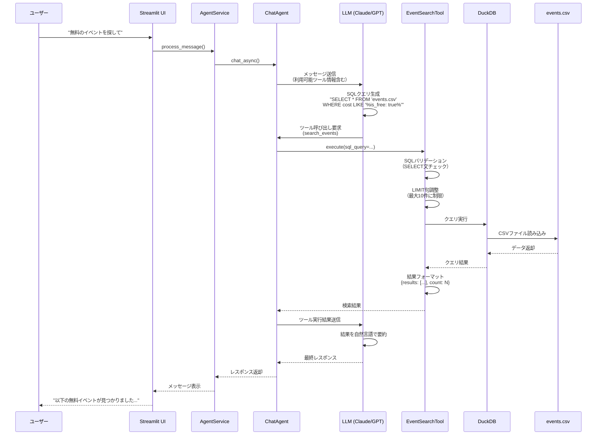

# イベントデータの検索をSQLを使って行うツールの追加

---

## 概要
エージェントがイベントデータ(input/events.csv)からイベントデータを検索できるようにする

### 目的
- エージェントがイベントデータを自由度高く検索できるようにしたい

### 背景
- とあるエリアのイベント情報を検索できるコンシェルジュエージェントAIを開発中
- 現状、エージェントは様々なツールを使うことが出来るが、イベントデータを検索するためのツールが無い
- エージェントは様々な要求に対応できるようにするために、検索ツールの自由度は高くする必要がある

### 要件
- 既存のツールに習って検索ツールを追加する(完全に新しい機能を追加しようとしない)
- SQLを使って検索する
- 検索時のデータのlimitは10に設定するようにツールに設定するプロンプトによって指示する
- データの仕様をツールのプロンプトに記載して、エージェントがデータの概要を理解して検索を行えるようにする
  - データは今後追加などがあるため、データの数などの変化しそうな要素は説明に含めない

---

## 具体的な設計

### 1. 修正・追加対象ファイル

#### 新規作成するファイル
- `src/core/tools/event_search_tool.py` - イベント検索ツールの実装

#### 修正するファイル
- `src/core/tools/__init__.py` - 新しいツールの登録
- `src/core/tools/registry.py` - LangChain互換ツールの定義追加
- `pyproject.toml` - DuckDBの依存関係追加

### 2. 使用技術

#### DuckDB
- **選定理由**: CSVファイルに直接SQLクエリを実行できる軽量なデータベースエンジン
- **特徴**:
  - データベースファイルの作成不要
  - CSVファイルを直接読み込んでSQL実行可能
  - Pythonとの統合が容易
  - 高速なクエリ実行
- **インストール**: `pip install duckdb`（Python 3.9以上が必要）

### 3. データ仕様

#### イベントデータ(input/events.csv)のスキーマ

| カラム名 | データ型 | 説明 | 例 |
|---------|---------|------|-----|
| event_name | TEXT | イベント名 | "BMW X5 / X6 Edition Shadow ローンチ記念プレゼントキャンペーン" |
| description | TEXT | イベントの説明 | "BMW X5 / X6 Edition Shadowのローンチを記念..." |
| date_time | TEXT | 開催日時（YYYY-MM-DD形式または期間） | "2025-09-17/2025-10-19" |
| location | TEXT | 開催場所（JSON形式の文字列） | "{\"venue\": \"FREUDE by BMW\", \"address\": null}" |
| capacity | TEXT | 定員 | "2名" または "100組200名" |
| source_url | TEXT | 情報元URL | "https://www.bmw.com/..." |
| extracted_at | TEXT | データ抽出日時 | "2025-09-24T12:32:59.876957" |
| additional_info | TEXT | 追加情報 | "アンケート回答期間：2025年10月1日..." |
| contact_info | TEXT | 連絡先情報（JSON形式） | "{\"phone\": \"03-5544-9636\", \"email\": null}" |
| cost | TEXT | 費用情報（JSON形式） | "{\"is_free\": true, \"amount\": null, ...}" |
| registration_required | TEXT | 事前登録要否 | "True" または 空文字 |
| target_audience | TEXT | 対象者（JSON配列） | "[\"家族\"]" または "[]" |

**注意点**:
- `location`, `contact_info`, `cost`, `target_audience`はJSON形式の文字列として格納
- `date_time`は期間の場合「開始日/終了日」形式
- 空値はnullまたは空文字列で表現

### 4. ツールの処理フロー


### 5. 実装内容

#### 5.1 EventSearchTool クラスの実装

**クラス構造**:
- `BaseTool`を継承
- `name`プロパティ: `"search_events"`
- `description`プロパティ: ツールの説明とデータスキーマ情報
- `execute(sql_query: str)`メソッド: SQL実行とバリデーション

**主要メソッド**:

##### `execute(sql_query: str) -> dict`
- SQLクエリを受け取り、実行結果を返す
- 処理手順:
  1. SQLクエリのバリデーション（`_validate_sql()`を呼び出し）
  2. LIMIT句の処理（`_ensure_limit()`を呼び出し）
  3. DuckDBでCSVファイルに対してクエリ実行
  4. 結果を辞書形式で返却（`{"results": [...], "count": N}`）
  5. エラー時は`{"error": "エラーメッセージ"}`を返却

##### `_validate_sql(sql_query: str) -> tuple[bool, str]`
- SQLクエリが安全かどうかを検証
- 検証項目:
  - SELECT文で始まっているか
  - 危険なキーワードが含まれていないか（INSERT, UPDATE, DELETE, DROP, ALTER, CREATE, TRUNCATE, EXEC, EXECUTEなど）
  - セミコロンで複数クエリが連結されていないか
- 戻り値: (検証成功/失敗, エラーメッセージ)

##### `_ensure_limit(sql_query: str) -> str`
- SQLクエリにLIMIT句を追加または調整
- 処理ロジック:
  - LIMIT句が既に存在する場合: 10以下に制限
  - LIMIT句がない場合: `LIMIT 10`を末尾に追加
- 戻り値: 調整後のSQLクエリ

##### `_execute_duckdb_query(sql_query: str) -> list[dict]`
- DuckDBを使用してCSVファイルに対しSQLを実行
- 処理手順:
  1. DuckDBコネクション作成（インメモリ）
  2. CSVファイルパスを含むSQLクエリ実行
    - テーブル名として`'input/events.csv'`または`read_csv('input/events.csv')`を使用
  3. 結果を辞書のリストに変換
  4. コネクションクローズ
- 戻り値: クエリ結果（辞書のリスト）

#### 5.2 ツールのdescription（エージェント向けプロンプト）

```
search_events: イベントデータをSQLクエリで検索します。

【使用方法】
- SQLクエリを指定してイベント情報を検索できます
- FROM句には 'events.csv' を指定してください
- SELECT文のみ使用可能です（INSERT/UPDATE/DELETE等は使用不可）

【重要な制約】
- 検索結果は最大10件までに制限されます
- クエリにLIMIT句がない場合、自動的に LIMIT 10 が追加されます
- LIMIT句を指定する場合も、10以下に制限されます

【データスキーマ】
テーブル名: events.csv

カラム:
- event_name (TEXT): イベント名
- description (TEXT): イベントの説明
- date_time (TEXT): 開催日時（YYYY-MM-DD形式または"開始日/終了日"形式）
- location (TEXT): 開催場所（JSON形式: {"venue": "会場名", "address": "住所"}）
- capacity (TEXT): 定員
- source_url (TEXT): 情報元URL
- extracted_at (TEXT): データ抽出日時
- additional_info (TEXT): 追加情報
- contact_info (TEXT): 連絡先（JSON形式: {"phone": "電話番号", "email": "メールアドレス"}）
- cost (TEXT): 費用情報（JSON形式: {"is_free": true/false, "amount": "金額", "notes": "備考"}）
- registration_required (TEXT): 事前登録の要否（"True"または空文字）
- target_audience (TEXT): 対象者（JSON配列形式: ["家族", "子供"]）

【検索例】
1. イベント名で検索:
   SELECT * FROM 'events.csv' WHERE event_name LIKE '%BMW%'

2. 無料イベントを検索:
   SELECT * FROM 'events.csv' WHERE cost LIKE '%"is_free": true%'

3. 特定期間のイベントを検索:
   SELECT * FROM 'events.csv' WHERE date_time LIKE '2025-10%'

4. 複数条件での検索:
   SELECT event_name, date_time, location FROM 'events.csv'
   WHERE description LIKE '%記念%' AND registration_required = 'True'
   ORDER BY date_time
```

#### 5.3 ToolRegistry への登録

`src/core/tools/registry.py`の`_create_langchain_tool()`メソッドに以下を追加:

```python
elif tool_name == "search_events":
    @tool
    def search_events(sql_query: str) -> dict:
        """イベントデータをSQLクエリで検索します。

        Args:
            sql_query: 実行するSQLクエリ（SELECT文のみ）

        Returns:
            検索結果の辞書（results: 結果リスト, count: 件数）
        """
        return tool_instance.execute(sql_query=sql_query)

    return search_events
```

### 6. 実装手順とチェック方法

#### ステップ1: DuckDBのインストールと動作確認

**実装内容**:
- `pyproject.toml`の`dependencies`に`"duckdb>=1.0.0"`を追加
- パッケージのインストール実行

**チェック方法**:
```bash
# 依存関係の追加
pip install duckdb

# DuckDBが正常にインストールされているか確認
python -c "import duckdb; print(f'DuckDB version: {duckdb.__version__}')"

# CSVファイルに対する簡単なクエリテスト
python -c "
import duckdb
con = duckdb.connect()
result = con.execute(\"SELECT COUNT(*) as count FROM 'input/events.csv'\").fetchall()
print(f'Total events: {result[0][0]}')
con.close()
"
```

**期待される結果**:
- DuckDBのバージョンが表示される（例: `DuckDB version: 1.0.0`）
- イベント数が表示される（例: `Total events: 31`）

---

#### ステップ2: EventSearchToolクラスの基本実装

**実装内容**:
- `src/core/tools/event_search_tool.py`ファイルを新規作成
- `EventSearchTool`クラスを実装
  - `name`、`description`プロパティ
  - `execute()`メソッドの基本骨格
  - `_execute_duckdb_query()`メソッド

**チェック方法**:
```bash
# ツールファイルのインポートテスト
PYTHONPATH=. python -c "
from src.core.tools.event_search_tool import EventSearchTool
tool = EventSearchTool()
print(f'Tool name: {tool.name}')
print(f'Description length: {len(tool.description)} chars')
"

# 簡単なクエリの実行テスト
PYTHONPATH=. python -c "
from src.core.tools.event_search_tool import EventSearchTool
tool = EventSearchTool()
result = tool.execute(sql_query=\"SELECT event_name FROM 'input/events.csv' LIMIT 3\")
print('Query result:')
import json
print(json.dumps(result, ensure_ascii=False, indent=2))
"
```

**期待される結果**:
- ツール名が表示される（`Tool name: search_events`）
- descriptionの文字数が表示される
- 3件のイベント名が含まれる検索結果が表示される

---

#### ステップ3: SQLバリデーション機能の実装

**実装内容**:
- `_validate_sql()`メソッドを実装
- 危険なSQLキーワードの検出ロジック
- SELECT文のチェック

**チェック方法**:
```bash
# バリデーションテスト
PYTHONPATH=. python -c "
from src.core.tools.event_search_tool import EventSearchTool
tool = EventSearchTool()

# 正常なクエリ
result1 = tool.execute(sql_query=\"SELECT * FROM 'input/events.csv' LIMIT 5\")
print('Valid SELECT query:', 'error' not in result1)

# 危険なクエリ（DROP）
result2 = tool.execute(sql_query=\"DROP TABLE events\")
print('DROP query blocked:', 'error' in result2)

# 危険なクエリ（UPDATE）
result3 = tool.execute(sql_query=\"UPDATE 'input/events.csv' SET event_name='test'\")
print('UPDATE query blocked:', 'error' in result3)

# 複数クエリ
result4 = tool.execute(sql_query=\"SELECT * FROM 'input/events.csv'; DROP TABLE events;\")
print('Multiple queries blocked:', 'error' in result4)
"
```

**期待される結果**:
```
Valid SELECT query: True
DROP query blocked: True
UPDATE query blocked: True
Multiple queries blocked: True
```

---

#### ステップ4: LIMIT句の自動調整機能の実装

**実装内容**:
- `_ensure_limit()`メソッドを実装
- LIMIT句がない場合の追加ロジック
- LIMIT値が10を超える場合の調整ロジック

**チェック方法**:
```bash
# LIMIT句の調整テスト
PYTHONPATH=. python -c "
from src.core.tools.event_search_tool import EventSearchTool
tool = EventSearchTool()

# LIMIT句なし → LIMIT 10が追加されるか
result1 = tool.execute(sql_query=\"SELECT * FROM 'input/events.csv'\")
print('Without LIMIT - Result count:', result1.get('count', 0))
print('Should be <= 10:', result1.get('count', 0) <= 10)

# LIMIT 5 → そのまま
result2 = tool.execute(sql_query=\"SELECT * FROM 'input/events.csv' LIMIT 5\")
print('With LIMIT 5 - Result count:', result2.get('count', 0))
print('Should be 5:', result2.get('count', 0) == 5)

# LIMIT 100 → LIMIT 10に調整されるか
result3 = tool.execute(sql_query=\"SELECT * FROM 'input/events.csv' LIMIT 100\")
print('With LIMIT 100 - Result count:', result3.get('count', 0))
print('Should be <= 10:', result3.get('count', 0) <= 10)
"
```

**期待される結果**:
```
Without LIMIT - Result count: 10
Should be <= 10: True
With LIMIT 5 - Result count: 5
Should be 5: True
With LIMIT 100 - Result count: 10
Should be <= 10: True
```

---

#### ステップ5: ToolRegistryへの登録

**実装内容**:
- `src/core/tools/__init__.py`にツールのインポートと登録を追加
- `src/core/tools/registry.py`の`_create_langchain_tool()`メソッドに`search_events`の分岐を追加

**チェック方法**:
```bash
# ツールレジストリへの登録確認
PYTHONPATH=. python -c "
from src.core.tools import tool_registry

# 登録済みツール一覧
tools = tool_registry.get_all_tool_instances()
print('Registered tools:', list(tools.keys()))
print('search_events registered:', 'search_events' in tools)

# ツールインスタンス取得
tool = tool_registry.get_tool_instance('search_events')
print('Tool instance found:', tool is not None)
print('Tool name:', tool.name if tool else 'N/A')
"

# LangChain互換ツールの確認
PYTHONPATH=. python -c "
from src.core.tools import tool_registry

langchain_tools = tool_registry.get_all_tools()
print('Total LangChain tools:', len(langchain_tools))

# search_eventsツールを探す
search_tool = None
for t in langchain_tools:
    if hasattr(t, 'name') and t.name == 'search_events':
        search_tool = t
        break

print('search_events LangChain tool found:', search_tool is not None)
if search_tool:
    print('Tool description preview:', search_tool.description[:100] + '...')
"
```

**期待される結果**:
```
Registered tools: ['get_current_time', 'get_store_info', 'get_event_info', 'check_store_hours', ..., 'search_events']
search_events registered: True
Tool instance found: True
Tool name: search_events

Total LangChain tools: 7
search_events LangChain tool found: True
Tool description preview: イベントデータをSQLクエリで検索します。

【使用方法】
- SQLクエリを指定してイベント情報を検索できます...
```

---

#### ステップ6: エージェント統合テスト

**実装内容**:
- AgentServiceでの利用確認
- Streamlit UIでの動作確認

**チェック方法**:
```bash
# AgentServiceでツールが利用可能か確認
PYTHONPATH=. python -c "
from src.core.services.agent_service import AgentService
from src.core.agents.chat_agent import ChatAgent
from src.infrastructure.llm.llm_factory import LLMFactory
from src.core.tools import tool_registry

# エージェント作成
llm_adapter = LLMFactory.create_llm('claude-sonnet-4.5')
agent = ChatAgent(llm_adapter=llm_adapter, tools=tool_registry.get_all_tools())

# ツール一覧に search_events が含まれているか
available_tools = agent.get_available_tools()
print('Available tools:', available_tools)
print('search_events available:', 'search_events' in available_tools)
"

# Streamlitアプリケーション起動テスト（手動確認）
echo "次のコマンドでStreamlitアプリを起動し、エージェントに「無料のイベントを検索して」と質問してください:"
echo "make run"
```

**期待される結果**:
- `search_events`がツール一覧に含まれる
- Streamlit UIでエージェントが`search_events`ツールを使用してイベント検索を実行できる

**手動テストシナリオ**:
1. Streamlitアプリを起動
2. 以下の質問をエージェントに投げる:
   - "無料のイベントを探して"
   - "10月に開催されるイベントは?"
   - "BMWに関連するイベントを教えて"
   - "事前登録が必要なイベントを検索して"
3. エージェントが`search_events`ツールを呼び出し、適切なSQLクエリを生成して検索結果を返すことを確認

---

#### ステップ7: ユニットテストの作成と実行

**実装内容**:
- `tests/unit/core/tools/test_event_search_tool.py`を作成
- 以下のテストケースを実装:
  - SQLバリデーション（正常系/異常系）
  - LIMIT句の調整
  - DuckDBクエリ実行
  - エラーハンドリング

**チェック方法**:
```bash
# ユニットテスト実行
PYTHONPATH=. pytest tests/unit/core/tools/test_event_search_tool.py -v

# カバレッジ付きテスト実行
PYTHONPATH=. pytest tests/unit/core/tools/test_event_search_tool.py -v --cov=src/core/tools/event_search_tool --cov-report=term-missing
```

**期待される結果**:
- すべてのテストがPASSする
- コードカバレッジが80%以上

---

### 7. アーキテクチャ図


**図の説明**:
- **緑色（EventSearchTool）**: 今回新規実装するツール
- **金色（DuckDB）**: 新たに導入する外部ライブラリ
- **青色（CSV File）**: 検索対象データ

---

### 8. データフロー図



---

### 9. 最終的に満たすべき要件

#### 機能要件
- ✅ エージェントがSQLクエリを生成してイベントデータを検索できる
- ✅ 全てのカラム（event_name, description, date_time, location, capacity, source_url, extracted_at, additional_info, contact_info, cost, registration_required, target_audience）が検索対象
- ✅ 検索結果は最大10件に制限される
- ✅ SELECT文のみ実行可能（INSERT/UPDATE/DELETE等は禁止）
- ✅ ツールのdescriptionにデータスキーマ情報が含まれる

#### 技術要件
- ✅ DuckDBを使用してCSVファイルに直接SQLクエリを実行
- ✅ データベースファイルの作成不要（インメモリ実行）
- ✅ 既存のツールアーキテクチャ（BaseToolパターン、ToolRegistry）に準拠
- ✅ Clean Architectureの層分離を維持

#### セキュリティ要件
- ✅ SQLインジェクション対策（危険なキーワードの検出）
- ✅ 複数クエリ実行の防止（セミコロン区切りの検出）
- ✅ SELECT文以外の実行を拒否

#### テスト要件
- ✅ ユニットテストが実装されている
- ✅ 正常系・異常系のテストケースをカバー
- ✅ コードカバレッジ80%以上

#### 運用要件
- ✅ エラー発生時に適切なエラーメッセージを返却
- ✅ ログ出力による動作トレース可能性
- ✅ pyproject.tomlに依存関係が記載されている

---

## 補足事項

### JSON形式カラムの検索方法

一部のカラム（location, contact_info, cost, target_audience）はJSON形式の文字列として保存されています。これらを検索する際の例:

```sql
-- 無料イベントの検索
SELECT * FROM 'events.csv' WHERE cost LIKE '%"is_free": true%'

-- 特定の会場での検索
SELECT * FROM 'events.csv' WHERE location LIKE '%FREUDE by BMW%'

-- 電話番号が登録されているイベント
SELECT * FROM 'events.csv' WHERE contact_info NOT LIKE '%"phone": null%'

-- 家族向けイベント
SELECT * FROM 'events.csv' WHERE target_audience LIKE '%家族%'
```

### エージェントへの指示例

エージェントに対してユーザーが自然言語で質問した場合、エージェントは以下のようにSQLクエリに変換することが期待されます:

| ユーザーの質問 | エージェントが生成するSQLクエリ例 |
|-------------|---------------------------|
| "無料のイベントを探して" | `SELECT * FROM 'events.csv' WHERE cost LIKE '%"is_free": true%' LIMIT 10` |
| "10月開催のイベントは?" | `SELECT * FROM 'events.csv' WHERE date_time LIKE '2025-10%' LIMIT 10` |
| "BMWのイベント教えて" | `SELECT * FROM 'events.csv' WHERE event_name LIKE '%BMW%' OR description LIKE '%BMW%' LIMIT 10` |
| "事前登録が必要なイベント" | `SELECT * FROM 'events.csv' WHERE registration_required = 'True' LIMIT 10` |

### パフォーマンス考慮事項

- DuckDBはCSVファイルを効率的に読み込むため、数千行程度のデータであれば高速に検索可能
- データ量が増加した場合、インデックスが必要になる可能性があるが、現状のデータ規模（31行）では不要
