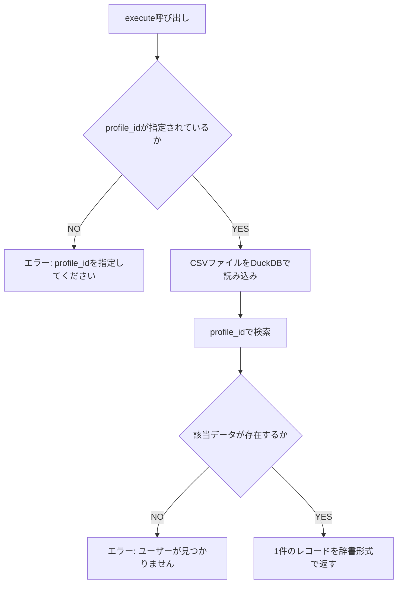
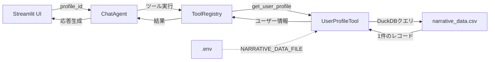
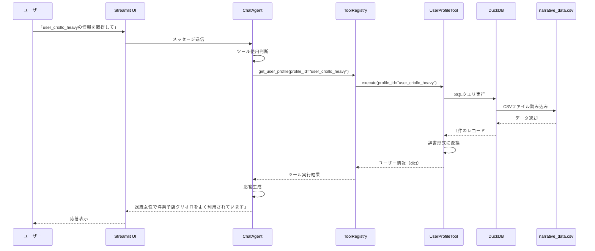

# ユーザープロファイル取得ツールの追加

---

## 概要
エージェントが対話中のユーザーのプロファイル・行動パターン情報を取得できるようにする。

### 目的
- エージェントが対話中のユーザーの属性（年齢、性別、タイプ）や行動パターンを把握できるようにする
- ユーザーの嗜好性や購買履歴に基づいた、パーソナライズされた提案を可能にする
- ユーザーのニーズ（「いつもの店」vs「新しい店」）に応じた適切なレコメンデーションを実現する

### 背景
- とあるエリアのコンシェルジュエージェントAIを開発中
- 現状、エージェントは商品・店舗・イベント情報を検索できるが、対話中のユーザーの行動パターンや嗜好性を理解できない
- ユーザーの購買履歴分析結果（ナラティブ）を参照することで、よりパーソナライズされた提案が可能になる

### ユースケース例
1. **いつもの店をレコメンド**
   - ユーザー: 「おすすめのギフトを教えて」
   - エージェント: プロファイルを確認 → primary_store_name（洋菓子店クリオロ）をレコメンド

2. **新しい店をレコメンド**
   - ユーザー: 「いつもと違うものを見てみたい」
   - エージェント: プロファイルのnarrative（「和カフェ（中村藤吉）やスペシャルティコーヒー専門店（アラビカ）の散発的な利用も見られる」）を参照 → 類似カテゴリの別店舗を提案

3. **確認して提案**
   - エージェント: 「いつもお使いの店がよろしいですか？それとも新しいお店をお探しですか？」
   - ユーザー: 「いつもの店で」
   - エージェント: クリオロの商品を検索

4. **属性に基づく提案**
   - プロファイルで年齢28歳・女性を確認 → 年齢・性別に適したギフトカテゴリを提案

---

## 要件

### 機能要件

#### 1. ツールの基本仕様
- **ツール名**: `get_user_profile`
- **入力**: `profile_id`（文字列、例: "user_criollo_heavy"）
- **出力**: ユーザープロファイル情報（JSON形式の辞書）
- **データソース**: `input/narrative_data.csv`（環境変数で切り替え可能）

#### 2. セキュリティ制約
- **重要**: 1つのユーザーデータのみを取得（複数ユーザーの横断検索・一覧取得は禁止）
- profile_idが指定されない場合はエラーを返す
- 存在しないprofile_idが指定された場合はエラーを返す

#### 3. 環境変数によるデータファイル切り替え
- 環境変数 `NARRATIVE_DATA_FILE` でデータファイル名を指定
- デフォルト値: `narrative_data.csv`
- 例: `NARRATIVE_DATA_FILE=narrative_data_2.csv`
- UIからは変更不可（セキュリティ上の理由）

#### 4. 既存ツールとの整合性
- BaseToolクラスを継承して実装
- ToolRegistryに登録
- 既存のWeatherToolやStoreSearchToolと同様のパターンで実装

---

## データ仕様

### CSVファイル構造
**ファイル名**: `input/narrative_data.csv`（または`narrative_data_2.csv`）

**カラム構成**:

| カラム名 | 型 | 説明 | 例 |
|---------|-----|------|-----|
| profile_id | TEXT | ユーザープロファイルID（一意） | "user_criollo_heavy" |
| age | INTEGER | 年齢 | 28 |
| gender | TEXT | 性別 | "女性" |
| user_type | TEXT | ユーザータイプ | "特定店舗ロイヤルカスタマー" |
| primary_store_id | TEXT | 主要利用店舗ID | "STR-0014" |
| primary_store_name | TEXT | 主要利用店舗名 | "洋菓子店クリオロ" |
| visits | INTEGER | 主要店舗への訪問回数 | 26 |
| narrative | TEXT | 行動パターン・嗜好性の説明（長文テキスト） | "高品質なチョコレートや..." |

### データ特性
- 開発用の少数データ（2〜3ユーザー分）
- データ件数は今後も増えない想定
- narrativeカラムには改行を含む長文テキストが格納される

---

## 実装方針

### A. 実装方式の選択
**採用方式**: **シンプルなID指定型取得（非SQL方式）**

**理由**:
1. 複数ユーザー検索が禁止されているため、SQLの柔軟性が不要
2. データ件数が少なく固定的（パフォーマンス上の問題なし）
3. エージェントにとって使いやすい（profile_idを渡すだけ）
4. セキュリティ制約（1ユーザーのみ）を確実に実装できる

**SQLツール方式を採用しない理由**:
- EventSearchTool/StoreSearchToolはSQLで柔軟な検索が必要（WHERE句、複数件取得）
- ユーザープロファイルは1件取得のみで十分
- SQL方式だと複数ユーザー検索の禁止制約を徹底しにくい

### B. 実装するファイル

#### 新規作成ファイル
1. **`src/core/tools/user_profile_tool.py`**
   - UserProfileToolクラスの実装
   - BaseToolを継承

2. **`tests/unit/core/tools/test_user_profile_tool.py`**
   - ユニットテスト（pytest）

#### 修正ファイル
1. **`src/core/tools/__init__.py`**
   - UserProfileToolをインポート
   - tool_registryに登録

2. **`src/core/tools/registry.py`**
   - `_create_langchain_tool`メソッドに`get_user_profile`の分岐を追加

3. **`.env.example`**
   - 既に`NARRATIVE_DATA_FILE`の設定あり（修正不要）

---

## 実装詳細

### 1. UserProfileToolクラスの処理フロー



### 2. データ読み込み処理

**処理内容**:
- DuckDBを使用してCSVファイルを読み込む
- `WHERE profile_id = '{指定されたID}'` で1件のみ取得
- 結果を辞書形式に変換して返す

**エラーハンドリング**:
- CSVファイルが存在しない → ファイル読み込みエラー
- profile_idが存在しない → 「ユーザーが見つかりません」エラー
- 複数件取得される異常ケース → エラー（データ整合性違反）

### 3. ツールの説明文（description）

**含めるべき情報**:
- ツールの目的（対話中のユーザーのプロファイル取得）
- 入力パラメータ（profile_id）
- 出力形式（JSONの構造例）
- データの内容説明（年齢、性別、user_type、primary_store、visits、narrative）
- 使用例（具体的なprofile_id指定例）
- **重要な制約**: 1ユーザーのみ取得可能、複数ユーザー検索は不可

**含めないべき情報**:
- データ件数（「現在3ユーザー分のデータ」など）
- 将来変更される可能性のある具体的な値

### 4. 出力形式

**成功時**:
```json
{
  "profile_id": "user_criollo_heavy",
  "age": 28,
  "gender": "女性",
  "user_type": "特定店舗ロイヤルカスタマー",
  "primary_store_id": "STR-0014",
  "primary_store_name": "洋菓子店クリオロ",
  "visits": 26,
  "narrative": "高品質なチョコレートやスイーツへの強いこだわりを持ち、特にクリオロのブランドと商品への深い愛着がある。\n\n和カフェ（中村藤吉）やスペシャルティコーヒー専門店（アラビカ）の散発的な利用も見られる。ただし、新しい店舗を積極的に開拓するよりも、信頼できる品質と自分の好みが確立された店舗を繰り返し利用する傾向が強い。"
}
```

**エラー時**:
```json
{
  "error": "エラーメッセージ"
}
```

---

## 実装手順とテスト方法

### フェーズ1: ツール基本実装

#### タスク1-1: UserProfileToolクラスの作成
**実装内容**:
- `src/core/tools/user_profile_tool.py` を作成
- BaseToolを継承
- `name` プロパティ: `"get_user_profile"` を返す
- `description` プロパティ: ツール説明文を返す
- `__init__` メソッド:
  - プロジェクトルートのパスを取得
  - 環境変数からnarrative_data.csvのファイル名を取得
  - ファイルパスを構築
- `execute` メソッド:
  - profile_idのバリデーション
  - DuckDBでCSVを読み込み
  - WHERE句で1件取得
  - 辞書形式で返却

**動作確認方法**:
```bash
# Pythonインタラクティブシェルで動作確認
PYTHONPATH=. python -c "
from src.core.tools.user_profile_tool import UserProfileTool
tool = UserProfileTool()
print('Tool name:', tool.name)
print('Description length:', len(tool.description))
result = tool.execute(profile_id='user_criollo_heavy')
print('Result keys:', result.keys())
print('Profile ID:', result.get('profile_id'))
print('Age:', result.get('age'))
print('Primary store:', result.get('primary_store_name'))
"
```

**期待結果**:
- Tool name: get_user_profile
- Description length: 500以上（詳細な説明文）
- Result keys: dict_keys(['profile_id', 'age', 'gender', 'user_type', 'primary_store_id', 'primary_store_name', 'visits', 'narrative'])
- Profile ID: user_criollo_heavy
- Age: 28
- Primary store: 洋菓子店クリオロ

---

#### タスク1-2: エラーハンドリングの確認
**動作確認方法**:
```bash
# profile_id未指定のケース
PYTHONPATH=. python -c "
from src.core.tools.user_profile_tool import UserProfileTool
tool = UserProfileTool()
result = tool.execute()
print('Error:', result.get('error'))
"

# 存在しないprofile_idのケース
PYTHONPATH=. python -c "
from src.core.tools.user_profile_tool import UserProfileTool
tool = UserProfileTool()
result = tool.execute(profile_id='nonexistent_user')
print('Error:', result.get('error'))
"
```

**期待結果**:
- 1つ目: `Error: profile_idを指定してください`
- 2つ目: `Error: ユーザーが見つかりません: nonexistent_user` または類似のメッセージ

---

### フェーズ2: レジストリへの登録

#### タスク2-1: ToolRegistryの更新
**実装内容**:
- `src/core/tools/registry.py` の `_create_langchain_tool` メソッドを修正
- `get_user_profile` の分岐を追加
- LangChain互換ツールを作成（`@tool`デコレータ使用）

**参考実装パターン**（get_weatherと同様）:
```python
elif tool_name == "get_user_profile":
    @tool
    def get_user_profile(profile_id: str) -> dict:
        """対話中のユーザーのプロファイル情報を取得します。

        Args:
            profile_id: ユーザープロファイルID

        Returns:
            ユーザー情報の辞書（age, gender, user_type, primary_store, visits, narrative）
        """
        return tool_instance.execute(profile_id=profile_id)

    return get_user_profile
```

**動作確認方法**:
```bash
PYTHONPATH=. python -c "
from src.core.tools.registry import ToolRegistry
from src.core.tools.user_profile_tool import UserProfileTool

registry = ToolRegistry()
registry.register_tool(UserProfileTool())

# LangChainツールとして取得できることを確認
tools = registry.get_all_tools()
print('Tool count:', len(tools))
print('Tool names:', [t.name for t in tools])
"
```

**期待結果**:
- Tool count: 1
- Tool names: ['get_user_profile']

---

#### タスク2-2: __init__.pyの更新
**実装内容**:
- `src/core/tools/__init__.py` を修正
- UserProfileToolをインポート
- tool_registryに登録

**修正内容**:
```python
from src.core.tools.user_profile_tool import UserProfileTool

# ツールを登録
tool_registry.register_tool(UserProfileTool())

__all__ = [
    # ... 既存 ...
    "UserProfileTool",
]
```

**動作確認方法**:
```bash
PYTHONPATH=. python -c "
from src.core.tools import tool_registry
tools = tool_registry.get_all_tools()
print('Registered tools:', len(tools))
for tool in tools:
    print(f'  - {tool.name}')
"
```

**期待結果**:
```
Registered tools: 5
  - search_events
  - search_stores
  - search_products
  - get_weather
  - get_user_profile
```

---

### フェーズ3: ユニットテストの実装

#### タスク3-1: テストファイルの作成
**実装内容**:
- `tests/unit/core/tools/test_user_profile_tool.py` を作成
- EventSearchToolのテストを参考に実装

**テストケース**:
1. `test_tool_name`: ツール名が`"get_user_profile"`であることを確認
2. `test_tool_description`: descriptionが存在し、主要キーワードが含まれることを確認
3. `test_execute_valid_profile_id`: 正常なprofile_idで実行し、全カラムが取得できることを確認
4. `test_execute_without_profile_id`: profile_id未指定でエラーが返ることを確認
5. `test_execute_nonexistent_profile_id`: 存在しないprofile_idでエラーが返ることを確認
6. `test_execute_result_structure`: 結果の構造が正しいことを確認（8つのキーが存在）
7. `test_execute_narrative_field`: narrativeフィールドが文字列で取得できることを確認
8. `test_execute_numeric_fields`: age, visitsが整数型で取得できることを確認
9. `test_environment_variable_switch`: 環境変数でファイルを切り替えられることを確認（オプション）

**動作確認方法**:
```bash
# ユニットテストを実行
PYTHONPATH=. pytest tests/unit/core/tools/test_user_profile_tool.py -v

# カバレッジ付き実行
PYTHONPATH=. pytest tests/unit/core/tools/test_user_profile_tool.py -v --cov=src/core/tools/user_profile_tool --cov-report=term
```

**期待結果**:
- すべてのテストがPASS
- カバレッジ: 90%以上

---

### フェーズ4: 統合テスト

#### タスク4-1: エージェントとの統合確認
**動作確認方法**:
```bash
# Streamlitアプリを起動
make run
# または
PYTHONPATH=. streamlit run src/app.py
```

**テストシナリオ**:
1. アプリを開く
2. チャットで以下を入力:
   ```
   profile_id が "user_criollo_heavy" のユーザー情報を取得してください
   ```
3. エージェントがget_user_profileツールを使用することを確認
4. ツール実行結果にユーザー情報が表示されることを確認
5. エージェントが情報を解釈して応答することを確認（例: 「28歳の女性で、洋菓子店クリオロをよくご利用されていますね」）

**期待結果**:
- ツールが正常に実行される
- ユーザー情報が取得できる
- エージェントがnarrativeを理解して応答する

---

#### タスク4-2: エラーケースの確認
**テストシナリオ**:
```
存在しないprofile_id "nonexistent_user" の情報を取得してください
```

**期待結果**:
- エラーメッセージが表示される
- エージェントがエラーを適切に処理して応答する（例: 「申し訳ございません。そのユーザーIDは見つかりませんでした」）

---

#### タスク4-3: 環境変数切り替えの確認
**動作確認方法**:
```bash
# .envファイルを編集
echo "NARRATIVE_DATA_FILE=narrative_data_2.csv" >> .env

# アプリを再起動
make run
```

**テストシナリオ**:
```
profile_id が "user_diverse_frequent" のユーザー情報を取得してください
```

**期待結果**:
- narrative_data_2.csvからデータが取得される
- user_diverse_frequentの情報が表示される（35歳男性、高頻度多店舗利用型）

---

### フェーズ5: コード品質チェック

#### タスク5-1: 型チェック
**実行コマンド**:
```bash
PYTHONPATH=. mypy src/core/tools/user_profile_tool.py --no-error-summary
```

**期待結果**:
- 型エラーなし（Success: no issues found）

---

#### タスク5-2: フォーマット・リントチェック
**実行コマンド**:
```bash
make format
make lint
```

**期待結果**:
- フォーマット: 自動修正される
- リント: エラー・警告なし

---

#### タスク5-3: 統合テスト（全ツール）
**実行コマンド**:
```bash
make test
```

**期待結果**:
- 全テストがPASS
- 新規追加したテストを含めてすべて成功

---

## 最終確認事項

### 実装完了時に満たすべき要件

#### 機能要件
- [ ] UserProfileToolクラスが正しく実装されている
- [ ] profile_idを指定してユーザー情報を取得できる
- [ ] 8つのカラム（profile_id, age, gender, user_type, primary_store_id, primary_store_name, visits, narrative）がすべて取得できる
- [ ] profile_id未指定時に適切なエラーが返る
- [ ] 存在しないprofile_id指定時に適切なエラーが返る
- [ ] 環境変数 `NARRATIVE_DATA_FILE` でファイルを切り替えられる

#### セキュリティ要件
- [ ] 1ユーザーのみを取得する（複数ユーザー取得は不可）
- [ ] SQLインジェクションのリスクがない（DuckDBのパラメータ化クエリ使用）
- [ ] 環境変数以外の方法でファイルパスを変更できない

#### コード品質要件
- [ ] BaseToolクラスを正しく継承している
- [ ] 既存ツール（WeatherTool等）と同等のコーディングスタイル
- [ ] 型アノテーションが適切に付与されている
- [ ] ユニットテストが実装され、すべてPASSする
- [ ] mypy型チェックがPASSする
- [ ] RuffリントチェックがPASSする

#### 統合要件
- [ ] ToolRegistryに正しく登録されている
- [ ] LangChain互換ツールとして動作する
- [ ] Streamlitアプリからツールを使用できる
- [ ] エージェントがツールを適切に使用できる

---

## 参考情報

### 既存実装の参考ファイル
- **WeatherTool**: シンプルなツール実装の参考（非SQL型）
- **EventSearchTool**: DuckDBを使用したCSV読み込みの参考
- **StoreSearchTool**: エラーハンドリングとメッセージ返却の参考

### 技術スタック
- **DuckDB**: CSVファイルの読み込みとクエリ実行
- **Python**: 3.9以上
- **pytest**: ユニットテスト
- **mypy**: 型チェック
- **Ruff**: リント・フォーマット

---

## アーキテクチャ図



### 処理フロー



---

## 補足: SQL方式との比較

### なぜSQL方式を採用しないのか

| 観点 | SQL方式（EventSearchTool型） | ID指定方式（採用） |
|------|---------------------------|-----------------|
| **複数件取得** | 可能（WHERE句で柔軟に検索） | 不可（1件のみ） |
| **セキュリティ制約** | 複数ユーザー取得を防ぐのが難しい | 設計上1件のみ取得 |
| **使いやすさ** | SQLクエリを書く必要あり | profile_idを渡すだけ |
| **データ件数** | 大量データに適している | 少量データに適している |
| **実装複雑度** | 高（SQL検証、LIMIT制御等） | 低（シンプル） |

**結論**: ユーザープロファイル取得は「1件のみ取得」「データ少量」「シンプル」という特性から、ID指定方式が最適。

---

## まとめ

本仕様書では、ユーザープロファイル取得ツール（`get_user_profile`）の追加について、以下を明確化しました：

1. **修正・作成するファイル**: UserProfileToolクラス、レジストリ、テストファイル
2. **実装方式**: SQL方式ではなく、シンプルなID指定型取得
3. **処理内容**: profile_idを受け取り、DuckDBでCSVから1件取得して辞書形式で返却
4. **実装手順**: 5フェーズに分割し、各フェーズで動作確認可能
5. **満たすべき要件**: 機能、セキュリティ、コード品質、統合の各観点

この仕様に従って実装することで、エージェントが対話中のユーザーのプロファイル情報を適切に取得・活用できるようになります。
