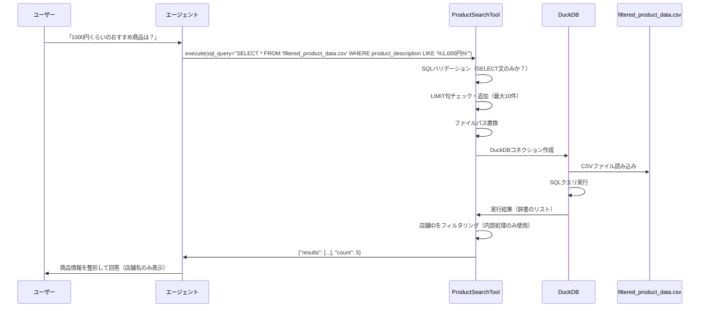
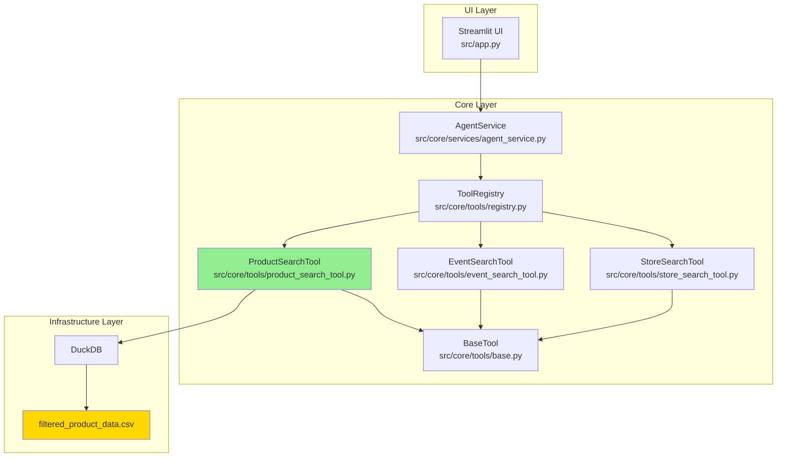

# 商品の検索をSQLを使って行うツールの追加

---

## 概要
エージェントが商品データ(filtered_product_data.csv)からユーザーにおすすめの商品を検索できるようにする

### 目的
- エージェントが商品データを自由度高く検索できるようにしたい

### 背景
- とあるエリアの商品情報を検索できるコンシェルジュエージェントAIを開発中
- 現状、エージェントは様々なツールを使うことが出来るが、おすすめのメニュー・商品を検索するためのツールが無い
- エージェントは様々な要求に対応できるようにするために、検索ツールの自由度は高くする必要がある

### 要件
- 既存のツールに習って検索ツールを追加する(完全に新しい機能を追加しようとしない)
- 共通化できる部分は共通化する
- SQLを使って検索する
- 検索時のデータのlimitは10に設定するようにツールに設定するプロンプトによって指示する
- データの仕様をツールのプロンプトに記載して、エージェントがデータの概要を理解して検索を行えるようにする
  - データは今後追加などがあるため、データの数などの変化しそうな要素は説明に含めない

---

## 詳細仕様

### 1. 対象データ

**ファイル**: `input/filtered_product_data.csv`

**データ構造**:
| カラム名 | 型 | 説明 | 例 |
|---------|-----|------|-----|
| store_id | TEXT | 店舗ID（内部処理用、ユーザーには非表示） | STR-0001 |
| store_name | TEXT | 店舗名（ユーザー向け表示用） | 麻布台ヒルズマーケット |
| product_name | TEXT | 商品名 | 手巻き寿司セット 天然本鮪入り |
| product_description | TEXT | 商品説明（価格情報を含む） | 豊洲市場を代表する...15,120円(税込)〜 |
| tag | TEXT | カテゴリタグ | フード、ギフト |

**データ件数**: 約270件（変動する可能性あり）

### 2. 作成・修正するファイル

#### 2.1 新規作成するファイル

##### `src/core/tools/product_search_tool.py`
- **目的**: 商品データをSQL検索するツールクラス
- **基底クラス**: `BaseTool`を継承
- **主要機能**:
  - 商品データに対するSQLクエリ実行
  - セキュリティバリデーション（SELECT文のみ許可、危険な操作の拒否）
  - LIMIT句の自動追加・調整（最大10件）
  - ファイルパスの自動置換（'filtered_product_data.csv' → 実際のファイルパス）
  - DuckDBを使用したCSVクエリ実行
  - 店舗IDのユーザーへの非表示（内部処理のみで使用）

##### `tests/unit/core/tools/test_product_search_tool.py`
- **目的**: ProductSearchToolのユニットテスト
- **テスト項目**:
  - ツール名の確認
  - ツール説明の存在確認
  - 正常なSQLクエリの実行
  - SQLクエリなしでの実行時のエラー処理
  - SELECT文の検証
  - 危険なSQL操作（INSERT、UPDATE、DELETE、DROP等）の拒否
  - LIMIT句の自動追加
  - LIMIT句の上限調整（100→10など）
  - WHERE句を含むクエリの実行
  - ORDER BY句を含むクエリの実行
  - 特定カラムのみの選択
  - 検索結果0件の処理

#### 2.2 修正するファイル

##### `src/core/tools/__init__.py`
- **修正内容**:
  - ProductSearchToolのインポート追加
  - ツールレジストリへのProductSearchTool登録
  - __all__へのProductSearchTool追加

##### `src/core/tools/registry.py`
- **修正内容**:
  - `_create_langchain_tool`メソッドに`search_products`の分岐追加
  - LangChain互換ツールの型注釈付き関数定義
  - パラメータ: `sql_query: str`
  - 戻り値: `dict`（results: 結果リスト, count: 件数）

##### `src/config/prompts.py`
- **修正内容**:
  - システムプロンプトの「利用可能なツール」セクションに自動反映（ツールレジストリから動的取得）
  - 「使用場面」セクションに商品検索の説明を追加
  - イベント検索ツールとの使い分けを明確化

### 3. 処理フロー



### 4. ツールの説明文（description）

ツールの`description`プロパティには、以下の内容を含める：

#### 4.1 対象データ
- このツールで検索できるのは**通常商品**（麻布台ヒルズマーケットなどで販売されている商品）
- イベント・期間限定商品は`search_events`ツールを使用

#### 4.2 使用方法
- SQLクエリを指定して商品情報を検索
- FROM句には`'filtered_product_data.csv'`を指定
- SELECT文のみ使用可能（INSERT/UPDATE/DELETE等は不可）

#### 4.3 重要な制約
- 検索結果は最大10件までに制限
- クエリにLIMIT句がない場合、自動的に`LIMIT 10`が追加
- LIMIT句を指定する場合も、10以下に制限

#### 4.4 データスキーマ
- テーブル名: `filtered_product_data.csv`
- カラム:
  - `store_name` (TEXT): 店舗名
  - `product_name` (TEXT): 商品名
  - `product_description` (TEXT): 商品説明（価格情報を含む）
  - `tag` (TEXT): カテゴリタグ（フード、ギフト等）
  - ※`store_id`は内部処理用のため説明に含めない

#### 4.5 検索例
1. **商品名で検索**:
   ```sql
   SELECT * FROM 'filtered_product_data.csv' WHERE product_name LIKE '%寿司%'
   ```

2. **価格帯で検索**（価格情報はproduct_descriptionに含まれる）:
   ```sql
   SELECT * FROM 'filtered_product_data.csv' WHERE product_description LIKE '%1,000円%'
   ```

3. **カテゴリで検索**:
   ```sql
   SELECT * FROM 'filtered_product_data.csv' WHERE tag = 'ギフト'
   ```

4. **店舗名で検索**:
   ```sql
   SELECT product_name, product_description FROM 'filtered_product_data.csv'
   WHERE store_name LIKE '%麻布台%'
   ```

5. **複数条件での検索**:
   ```sql
   SELECT product_name, product_description, tag FROM 'filtered_product_data.csv'
   WHERE tag = 'フード' AND product_description LIKE '%500円%'
   ORDER BY product_name
   ```

#### 4.6 使用場面の明確化
- 「おすすめの商品を教えて」→ このツールを使用
- 「1000円以下のギフトは？」→ このツールを使用
- 「予算2000円でランチできる商品」→ このツールを使用
- 「期間限定商品を教えて」→ `search_events`ツールを使用
- 「今月のキャンペーン商品は？」→ `search_events`ツールを使用

### 5. セキュリティ要件

EventSearchToolと同様のバリデーションを実装：

#### 5.1 許可する操作
- SELECT文のみ

#### 5.2 拒否する操作
- INSERT、UPDATE、DELETE、DROP
- ALTER、CREATE、TRUNCATE
- EXEC、EXECUTE、PRAGMA
- ATTACH、DETACH
- 複数クエリ（セミコロン区切り）

#### 5.3 バリデーション処理
- 正規表現を使用した危険なキーワードの検出
- 単語境界を考慮した検索（部分一致を避ける）
- 大文字小文字を区別しない検証

### 6. LIMIT句の制御

#### 6.1 自動追加
- クエリにLIMIT句がない場合、自動的に`LIMIT 10`を追加
- セミコロンの有無を考慮して適切な位置に追加

#### 6.2 上限調整
- 既存のLIMIT値が10を超える場合、`LIMIT 10`に調整
- 10以下の場合はそのまま保持

#### 6.3 大文字小文字の対応
- `LIMIT`、`limit`、`Limit`などすべてのパターンに対応

### 7. 出力フォーマット

#### 7.1 成功時
```json
{
  "results": [
    {
      "store_name": "麻布台ヒルズマーケット",
      "product_name": "手巻き寿司セット 天然本鮪入り",
      "product_description": "豊洲市場を代表するマグロ・鮮魚卸が用意する手巻き寿司セット。厳選された天然本鮪と旬の海鮮を心ゆくまで堪能できます。赤酢を使った特製酢飯、海苔、ガリ、本わさび、煮切り醤油付き。2人前から、15,120円(税込)〜",
      "tag": "フード"
    }
  ],
  "count": 1
}
```

**注意**: `store_id`は内部処理でのみ使用し、ユーザーへの出力には含めない

#### 7.2 エラー時
```json
{
  "error": "エラーメッセージ"
}
```

エラーの種類:
- SQLクエリが指定されていない
- SELECT文以外が使用されている
- 危険な操作が検出された
- 複数クエリが指定されている
- クエリ実行時のエラー

### 8. 実装手順と動作確認

#### ステップ1: ProductSearchToolクラスの実装
**作業内容**:
- `src/core/tools/product_search_tool.py`を新規作成
- EventSearchToolを参考にBaseToolを継承したクラスを実装
- 以下のメソッドを実装:
  - `__init__`: ファイルパスの初期化
  - `name`: ツール名を返す（"search_products"）
  - `description`: ツールの詳細説明を返す
  - `execute`: SQLクエリ実行のメインロジック
  - `_validate_sql`: SQLクエリのバリデーション
  - `_ensure_limit`: LIMIT句の自動追加・調整
  - `_execute_duckdb_query`: DuckDBでのクエリ実行

**動作確認方法**:
```bash
# Pythonインタプリタで直接実行
PYTHONPATH=. python -c "
from src.core.tools.product_search_tool import ProductSearchTool
tool = ProductSearchTool()
print('ツール名:', tool.name)
print('説明の長さ:', len(tool.description))
result = tool.execute(sql_query=\"SELECT * FROM 'filtered_product_data.csv' LIMIT 3\")
print('結果:', result)
print('件数:', result.get('count'))
"
```

**期待される結果**:
- ツール名が"search_products"と表示される
- 説明文が200文字以上存在する
- 結果に"results"と"count"キーが含まれる
- countが3である
- 各結果にstore_name、product_name、product_description、tagが含まれる

#### ステップ2: ユニットテストの実装
**作業内容**:
- `tests/unit/core/tools/test_product_search_tool.py`を新規作成
- EventSearchToolのテストを参考に以下のテストケースを実装:
  - ツール名のテスト
  - ツール説明のテスト
  - 正常なクエリ実行のテスト
  - エラーハンドリングのテスト
  - SQLバリデーションのテスト
  - LIMIT句制御のテスト
  - WHERE句、ORDER BY句のテスト
  - カラム指定のテスト
  - 危険な操作の拒否テスト
  - 空の結果のテスト

**動作確認方法**:
```bash
# 商品検索ツールのテストのみ実行
PYTHONPATH=. pytest tests/unit/core/tools/test_product_search_tool.py -v --no-cov
```

**期待される結果**:
- すべてのテストケースがPASSする
- テストカバレッジが80%以上
- エラーメッセージが適切に表示される

#### ステップ3: ツールレジストリへの登録
**作業内容**:
- `src/core/tools/__init__.py`を修正:
  - ProductSearchToolのインポート追加
  - `tool_registry.register_tool(ProductSearchTool())`の呼び出し追加
  - `__all__`にProductSearchToolを追加

- `src/core/tools/registry.py`を修正:
  - `_create_langchain_tool`メソッドに`search_products`の分岐を追加
  - LangChain互換の型注釈付き関数を定義

**動作確認方法**:
```bash
# ツールレジストリの確認
PYTHONPATH=. python -c "
from src.core.tools import tool_registry
tools = tool_registry.get_all_tool_instances()
print('登録済みツール:', list(tools.keys()))
print('search_productsの存在:', 'search_products' in tools)
tool = tools.get('search_products')
if tool:
    print('ツール名:', tool.name)
    print('説明の最初の100文字:', tool.description[:100])
"
```

**期待される結果**:
- 登録済みツールのリストに'search_products'が含まれる
- search_productsの存在がTrueと表示される
- ツール名と説明が正しく表示される

#### ステップ4: LangChain統合の確認
**作業内容**:
- ツールレジストリから取得したLangChain互換ツールの動作確認

**動作確認方法**:
```bash
# LangChain互換ツールの確認
PYTHONPATH=. python -c "
from src.core.tools import tool_registry
langchain_tools = tool_registry.get_all_tools()
product_tool = [t for t in langchain_tools if t.name == 'search_products'][0]
print('ツール名:', product_tool.name)
print('説明:', product_tool.description[:100])
result = product_tool.invoke({'sql_query': \"SELECT * FROM 'filtered_product_data.csv' WHERE tag = 'ギフト' LIMIT 5\"})
print('結果の型:', type(result))
print('結果の件数:', result.get('count'))
"
```

**期待される結果**:
- ツール名が"search_products"と表示される
- LangChainのtool.invoke()で正常に実行される
- ギフトタグの商品が5件まで取得される

#### ステップ5: エージェント統合テスト
**作業内容**:
- AgentServiceがProductSearchToolを使用できることを確認

**動作確認方法**:
```bash
# AgentServiceのインポート確認
PYTHONPATH=. python -c "
from src.core.services.agent_service import AgentService
print('AgentService Import OK')
"
```

```bash
# Streamlitアプリの起動
PYTHONPATH=. streamlit run src/app.py --server.headless=true --server.port=8501
```

UIでの動作確認:
1. アプリにアクセス
2. 以下のような質問を入力:
   - 「ギフトにおすすめの商品を教えて」
   - 「1000円くらいの商品は？」
   - 「麻布台ヒルズマーケットの商品を見せて」
   - 「フードカテゴリの商品を5件教えて」

**期待される結果**:
- エージェントがsearch_productsツールを自動的に使用する
- SQLクエリが生成され、適切な商品が検索される
- 検索結果が整形されてユーザーに表示される
- 店舗IDはユーザーに表示されず、店舗名のみが表示される
- LIMIT 10の制限が適用される

#### ステップ6: 統合テスト（全ツール）
**作業内容**:
- すべてのユニットテストを実行し、既存機能に影響がないことを確認

**動作確認方法**:
```bash
# すべてのユニットテストを実行
PYTHONPATH=. pytest tests/unit/ -v --no-cov
```

**期待される結果**:
- すべてのテストがPASSする
- 既存のツール（EventSearchTool、StoreSearchTool等）に影響がない
- 新規追加したProductSearchToolのテストもすべてPASSする

#### ステップ7: システムプロンプトの確認
**作業内容**:
- システムプロンプトに商品検索ツールが自動的に含まれることを確認
- ツールの説明がエージェントに正しく伝わることを確認

**動作確認方法**:
```bash
# システムプロンプトの確認
PYTHONPATH=. python -c "
from src.config.prompts import get_agent_system_prompt
prompt = get_agent_system_prompt()
content = prompt.content
print('search_productsの存在:', 'search_products' in content)
print('filtered_product_dataの存在:', 'filtered_product_data' in content)
# プロンプトの該当部分を表示
lines = content.split('\n')
for i, line in enumerate(lines):
    if 'search_products' in line:
        print(f'行{i}: {line}')
"
```

**期待される結果**:
- システムプロンプトに"search_products"が含まれる
- "filtered_product_data"の説明が含まれる
- ツールの使い分け（search_products vs search_events）が明記されている

### 9. 最終的に満たすべき要件

#### 9.1 機能要件
- [ ] ProductSearchToolクラスが実装され、BaseToolを継承している
- [ ] ツール名が"search_products"である
- [ ] SQLクエリでfiltered_product_data.csvを検索できる
- [ ] SELECT文のみを許可し、危険な操作を拒否する
- [ ] LIMIT句が自動的に追加・調整される（最大10件）
- [ ] DuckDBを使用してCSVファイルをクエリできる
- [ ] 検索結果が辞書形式（results、count）で返される
- [ ] エラー時は適切なエラーメッセージが返される

#### 9.2 セキュリティ要件
- [ ] INSERT、UPDATE、DELETE、DROP等の危険な操作が拒否される
- [ ] 複数クエリ（セミコロン区切り）が拒否される
- [ ] SQLインジェクション対策が施されている

#### 9.3 データ表示要件
- [ ] 店舗IDは内部処理でのみ使用し、ユーザーには表示されない
- [ ] 店舗名、商品名、商品説明、タグが検索結果に含まれる
- [ ] 価格情報がproduct_descriptionに含まれている

#### 9.4 統合要件
- [ ] ツールレジストリに正しく登録されている
- [ ] LangChain互換ツールとして動作する
- [ ] AgentServiceから使用できる
- [ ] システムプロンプトに自動的に含まれる
- [ ] Streamlit UIから使用できる

#### 9.5 テスト要件
- [ ] ユニットテストが実装されている
- [ ] すべてのテストケースがPASSする
- [ ] テストカバレッジが80%以上
- [ ] 既存のテストに影響を与えていない

#### 9.6 ドキュメント要件
- [ ] ツールのdescriptionが詳細に記載されている
- [ ] データスキーマが明記されている
- [ ] 検索例が5つ以上含まれている
- [ ] 使用場面が明確化されている
- [ ] 他のツール（search_events）との使い分けが明記されている

#### 9.7 ユーザビリティ要件
- [ ] エージェントが適切なタイミングで商品検索ツールを使用する
- [ ] 「ギフトを教えて」「予算1000円」などの質問に対応できる
- [ ] カテゴリ（フード、ギフト）での検索ができる
- [ ] 価格帯での検索ができる（LIKE句での部分一致）
- [ ] 店舗名での絞り込みができる

### 10. アーキテクチャ図



**凡例**:
- 緑色: 新規作成するファイル（ProductSearchTool）
- 黄色: 対象データファイル（filtered_product_data.csv）
- 白色: 既存ファイル（修正または影響を受けるファイル）

### 11. 共通化について

EventSearchToolとStoreSearchToolの実装パターンを完全に踏襲することで、以下の共通化を実現：

#### 11.1 コード構造の共通化
- BaseToolの継承パターン
- メソッド構成（`__init__`, `name`, `description`, `execute`, `_validate_sql`, `_ensure_limit`, `_execute_duckdb_query`）
- エラーハンドリングの方法
- ロギングの方法

#### 11.2 バリデーションロジックの共通化
- 同じ`_validate_sql`メソッドの実装
- 同じ危険なキーワードのリスト
- 同じ正規表現パターン

#### 11.3 LIMIT制御ロジックの共通化
- 同じ`_ensure_limit`メソッドの実装
- 同じ上限値（10件）
- 同じ調整ロジック

#### 11.4 DuckDB実行ロジックの共通化
- 同じ`_execute_duckdb_query`メソッドの実装
- 同じコネクション管理
- 同じ結果変換処理

#### 11.5 今後の拡張性
将来的に、さらなる共通化が必要になった場合は以下の選択肢がある：
1. 抽象基底クラス`BaseSQLSearchTool`を作成し、共通ロジックを集約
2. ユーティリティモジュール`sql_utils.py`を作成し、共通関数を抽出
3. 現状のコピーパターンを維持（シンプルで理解しやすい）

現時点では、要件「既存のツールに習って検索ツールを追加する」に従い、**オプション3（コピーパターン）**を採用する。
