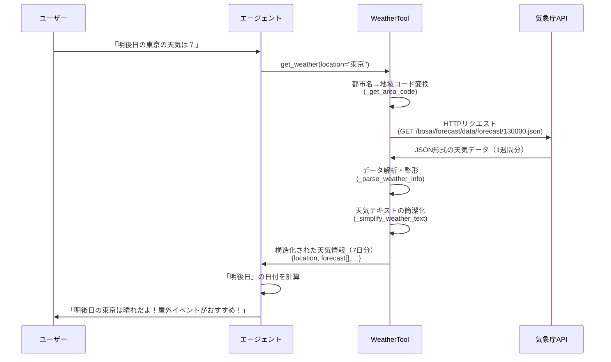
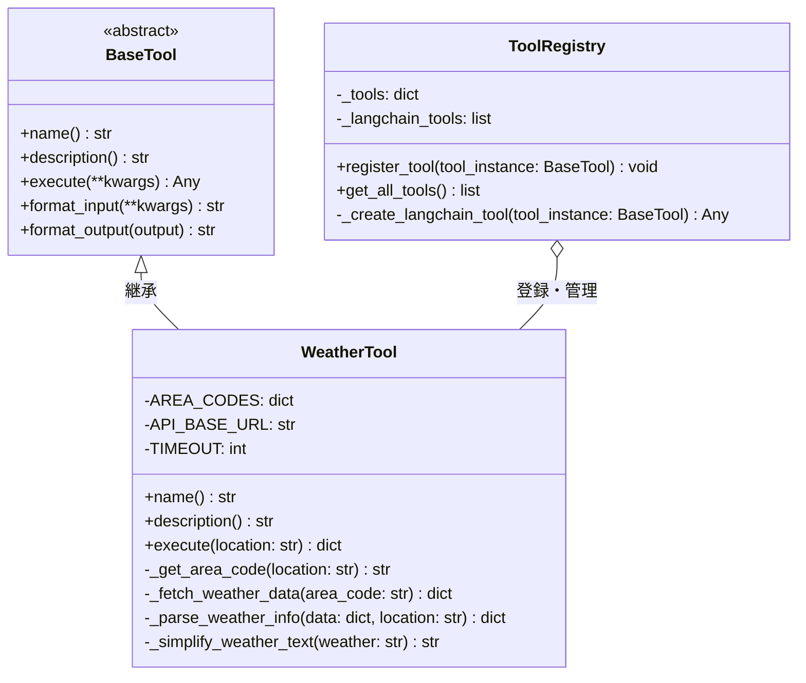

# 天気情報取得ツールの追加

---

## 概要
エージェントが指定された地域の現在の天気と天気予報を取得できるようにする

### 目的
- エージェントが天気情報を取得し、ユーザーに天気に応じた適切なアドバイスを提供できるようにしたい

### 背景
- とあるエリアのイベント情報を検索できるコンシェルジュエージェントAIを開発中
- ユーザーに対して「今日の東京の天気は雨なので、屋内イベントがおすすめです！」のような天気を考慮したアドバイスを提供したい
- 現状、エージェントは天気情報を取得する手段がない

### 要件
- 既存のツールアーキテクチャに習ってツールを追加する
- 1週間分の天気予報を取得できるようにする（今日から7日後まで）
- 地域指定は都市名で行えるようにする
- エージェントが天気情報を理解し、ユーザーに適切なアドバイスを提供できるようなデータを返す
- 「明後日」「週末」などの質問にも対応できるようにする
  - エージェント（LLM）が1週間分のデータから日付を自動判定して回答する方式

### スコープ
- **対象地域**: 東京のみ（初期実装）
- **データ提供元**: 気象庁API（無料、認証不要）
- **エラー時の動作**: APIがダウンしている場合は、エラーを返すのみ（リトライやフォールバックは実装しない）

---

## 詳細仕様

### 修正・追加対象ファイル

#### 新規作成
1. **`src/core/tools/weather_tool.py`**
   - 天気情報取得ツールの実装
   - BaseToolを継承したWeatherToolクラス

#### 修正
2. **`src/core/tools/registry.py`**
   - WeatherToolをLangChainツールとして登録するロジックを追加

3. **`src/core/tools/__init__.py`**
   - WeatherToolをインポートし、tool_registryに登録

4. **`tests/unit/core/tools/test_weather_tool.py`** (新規作成)
   - WeatherToolのユニットテスト

---

### 処理の流れ

#### シーケンス図


#### クラス図


---

### 実装詳細

#### 1. WeatherToolクラスの実装内容

**基本構造:**
- BaseToolを継承（`src/core/tools/base.py`）
- ツール名: `get_weather`
- 非同期実行には対応しない（同期処理のみ）

**依存ライブラリ:**
```python
import requests  # HTTPリクエスト（既にpyproject.tomlに含まれている）
from datetime import datetime  # 日付処理
from typing import Any, Dict  # 型注釈
from src.core.tools.base import BaseTool  # 基底クラス
from src.utils.logger import get_logger  # ログ出力

logger = get_logger(__name__)
```

**ログ出力ポリシー:**
- API呼び出し時: `logger.info(f"Fetching weather data for area code: {area_code}")`
- データ取得成功時: `logger.info(f"Successfully fetched weather data for {location}")`
- エラー発生時: `logger.error(f"Failed to fetch weather data: {error_message}")`
- データ解析時: `logger.debug(f"Parsing weather data for {len(forecasts)} days")`

**主要メソッド:**

1. **`name`プロパティ**
   - 返り値: `"get_weather"`

2. **`description`プロパティ**
   - ツールの使用方法、対応地域、返り値の説明を含む
   - エージェントが理解しやすい日本語で記述
   - 「今日から7日後までの天気予報を取得できる」ことを明記
   - 記載内容例:
     ```
     指定された地域の1週間分の天気予報を取得します。

     【対応地域】
     - 東京

     【取得できる情報】
     - 今日から7日後までの天気予報（最大7日分）
     - 各日の天気状態（晴れ、曇り、雨など）
     - 各日の最低気温・最高気温

     【使用例】
     - location="東京" で東京の1週間分の天気予報を取得

     【返り値】
     - forecast配列に日ごとの天気情報が含まれます
     - エージェントは返却されたデータから「明日」「明後日」「週末」などを判定して回答してください
     ```

3. **`execute(location: str) -> dict`**
   - 引数: `location` (都市名、例: "東京", "大阪")
   - 処理内容:
     1. 都市名を気象庁の地域コードに変換
     2. 気象庁APIにHTTPリクエストを送信
     3. レスポンスをJSON解析
     4. 1週間分（最大7日分）の天気予報を抽出・整形
     5. 構造化されたデータを返す
   - 返り値: 天気情報の辞書（詳細は後述）

4. **`_get_area_code(location: str) -> str`** (内部メソッド)
   - 都市名から気象庁の地域コードを取得
   - 主要都市のマッピング辞書を使用
   - 対応都市例: 東京、大阪、名古屋、福岡、札幌、仙台など

5. **`_fetch_weather_data(area_code: str) -> dict`** (内部メソッド)
   - 気象庁APIにリクエストを送信してJSONデータを取得
   - 使用API: `https://www.jma.go.jp/bosai/forecast/data/forecast/{area_code}.json`
   - タイムアウト: 10秒
   - エラーハンドリング: 接続エラー、タイムアウト、JSONパースエラー

6. **`_parse_weather_info(data: dict, location: str) -> dict`** (内部メソッド)
   - APIレスポンスから必要な情報を抽出
   - 1週間分の天気予報を取得（最大7日分）
   - データ構造を整形
   - 処理詳細:
     1. `data[1]`（週間予報）から天気と気温データを抽出
     2. `timeSeries[0]`から天気情報（weathers配列）を取得
     3. `timeSeries[1]`から気温情報（tempsMin/tempsMax配列）を取得
     4. `timeDefines`配列から日付情報を取得
     5. 各日のデータを統合して返却用の構造に整形
     6. 空文字列の気温データは適切に処理（Noneまたは除外）

7. **`_simplify_weather_text(weather: str) -> str`** (内部メソッド)
   - 気象庁の詳細な天気文字列を簡潔に整形
   - 例: "くもり　夜　雨" → "曇り時々雨"
   - 例: "雨　昼前　から　くもり" → "雨のち曇り"
   - 例: "晴れ" → "晴れ"

**返り値のデータ構造:**
```json
{
  "location": "東京",
  "area_code": "130000",
  "forecast": [
    {
      "date": "2025-10-22",
      "weather": "雨のち曇り",
      "temperature": {
        "min": "12",
        "max": "19"
      }
    },
    {
      "date": "2025-10-23",
      "weather": "曇り時々晴れ",
      "temperature": {
        "min": "12",
        "max": "20"
      }
    },
    {
      "date": "2025-10-24",
      "weather": "晴れ",
      "temperature": {
        "min": "12",
        "max": "20"
      }
    }
    // ... 最大7日分
  ],
  "publishing_office": "気象庁",
  "report_datetime": "2025-10-21T11:00:00+09:00"
}
```

**注意点:**
- `forecast`配列の最初の日付は通常「明日」から始まります（今日のデータは含まれない場合があります）
- `temperature.min`/`max`が空文字列の場合は、そのフィールドを除外します
- `weather`フィールドは`_simplify_weather_text`で簡潔に整形された文字列です

エラー時の返り値:
```json
{
  "error": "エラーメッセージ"
}
```

**エラーハンドリング:**
- 未対応の都市名の場合: `{"error": "指定された地域はサポートされていません: {location}"}`
- API接続エラー: `{"error": "天気情報の取得に失敗しました: {エラー詳細}"}`
- データ解析エラー: `{"error": "天気データの解析に失敗しました"}`

**対応地域リスト（初期実装）:**
| 都市名 | 地域コード | 備考 |
|--------|-----------|------|
| 東京   | 130000    | 初期実装で対応（必須） |

※将来的に他の都市を追加する場合の参考データ:
| 都市名 | 地域コード |
|--------|-----------|
| 大阪   | 270000    |
| 名古屋 | 230000    |
| 福岡   | 400000    |
| 札幌   | 016000    |
| 仙台   | 040000    |
| 広島   | 340000    |
| 神戸   | 280000    |

---

#### 気象庁APIの詳細仕様

**APIエンドポイント:**
```
https://www.jma.go.jp/bosai/forecast/data/forecast/{area_code}.json
```

**実際のレスポンス構造（重要部分の抜粋）:**
```json
[
  {
    "publishingOffice": "気象庁",
    "reportDatetime": "2025-10-21T11:00:00+09:00",
    "timeSeries": [
      {
        "timeDefines": [
          "2025-10-21T11:00:00+09:00",
          "2025-10-22T00:00:00+09:00",
          "2025-10-23T00:00:00+09:00"
        ],
        "areas": [
          {
            "area": {"name": "東京地方", "code": "130010"},
            "weatherCodes": ["214", "313", "201"],
            "weathers": ["くもり　夜　雨", "雨　昼前　から　くもり", "くもり　時々　晴れ"]
          }
        ]
      },
      {
        "timeDefines": [...],
        "areas": [
          {
            "area": {"name": "東京", "code": "44132"},
            "temps": ["17", "17", "11", "14"]
          }
        ]
      }
    ]
  },
  {
    "publishingOffice": "気象庁",
    "reportDatetime": "2025-10-21T11:00:00+09:00",
    "timeSeries": [
      {
        "timeDefines": [
          "2025-10-22T00:00:00+09:00",
          "2025-10-23T00:00:00+09:00",
          "2025-10-24T00:00:00+09:00",
          "2025-10-25T00:00:00+09:00",
          "2025-10-26T00:00:00+09:00",
          "2025-10-27T00:00:00+09:00",
          "2025-10-28T00:00:00+09:00"
        ],
        "areas": [
          {
            "area": {"name": "東京地方", "code": "130010"},
            "weatherCodes": ["313", "201", "101", "200", "202", "200", "101"],
            "weathers": [...],
            "pops": ["", "30", "20", "40", "70", "40", "20"]
          }
        ]
      },
      {
        "timeDefines": ["2025-10-22T00:00:00+09:00", ...],
        "areas": [
          {
            "area": {"name": "東京", "code": "44132"},
            "tempsMin": ["", "12", "12", "12", "14", "16", "14"],
            "tempsMax": ["", "19", "20", "20", "19", "22", "20"]
          }
        ]
      }
    ]
  }
]
```

**データ抽出ロジック:**
1. レスポンスはJSON配列（2要素）
   - `[0]`: 今日〜3日分の詳細予報
   - `[1]`: 今日〜7日分の週間予報（こちらを主に使用）
2. `[1].timeSeries[0]`: 天気情報（weathers配列）
3. `[1].timeSeries[1]`: 気温情報（tempsMin/tempsMax配列）
4. `timeDefines`配列と`weathers`/`temps`配列のインデックスを対応させて整形
5. 「東京地方」（code: 130010）の天気情報を取得
6. 「東京」（code: 44132）の気温情報を取得

**注意事項:**
- 気温の最初の要素は空文字列（""）の場合があるため、適切にハンドリングする
- `weathers`配列の値は詳細な文章（例: "くもり　夜　雨"）なので、簡潔に整形する
- 降水確率（pops）も取得可能だが、初期実装では天気と気温のみでOK

---

#### 2. ToolRegistryの修正内容

**修正箇所:** `src/core/tools/registry.py`の`_create_langchain_tool`メソッド

**追加内容:**
- `tool_name == "get_weather"`の条件分岐を追加
- LangChainの`@tool`デコレータを使用してツールを定義
- 型注釈付きの関数を作成:
  ```python
  @tool
  def get_weather(location: str) -> dict:
      """指定された地域の1週間分の天気予報を取得します。

      Args:
          location: 都市名（例: 東京、大阪）

      Returns:
          天気情報の辞書（最大7日分の天気、気温）
      """
      return tool_instance.execute(location=location)
  ```

---

#### 3. ツール登録の修正内容

**修正箇所:** `src/core/tools/__init__.py`

**追加内容:**
```python
from src.core.tools.weather_tool import WeatherTool

# WeatherToolの登録
tool_registry.register_tool(WeatherTool())
```

---

### 実装時の重要な注意事項

#### コーディング規約
- **型注釈**: すべての関数・メソッドに型注釈を追加（mypy対応）
- **行の長さ**: 120文字以内（Black/Ruff設定に準拠）
- **インポート順序**: isort設定に従う（標準ライブラリ→サードパーティ→ローカル）
- **docstring**: すべてのpublicメソッドにdocstringを記載

#### 既存パターンへの準拠
- `GetCurrentTimeTool` (`src/core/tools/time_tool.py`) を参考にする
- `EventSearchTool` (`src/core/tools/event_search_tool.py`) のエラーハンドリングパターンを参考にする
- ロガーの使い方は既存ツールと同様に `get_logger(__name__)` を使用

#### テストデータの準備
- 気象庁APIの実際のレスポンスをコピーしてモックデータとして使用
- `tests/unit/core/tools/test_time_tool.py` のテスト構造を参考にする
- `@pytest.mark.unit` マーカーを追加

#### コミット前のチェック
```bash
# フォーマット確認
make format

# 型チェック
make type-check

# リント
make lint

# テスト実行
PYTHONPATH=. pytest tests/unit/core/tools/test_weather_tool.py -v --no-cov

# すべてのチェック
make check-all
```

---

### 実装手順とテスト方法

#### ステップ1: WeatherToolクラスの基本実装

**実装内容:**
- `src/core/tools/weather_tool.py`を作成
- BaseToolを継承したWeatherToolクラスを実装
- `name`と`description`プロパティを実装
- 基本的な`execute`メソッドの骨組みを作成（まだAPIは呼ばない）

**確認方法:**
```bash
PYTHONPATH=. python -c "from src.core.tools.weather_tool import WeatherTool; tool = WeatherTool(); print(tool.name); print(tool.description)"
```

**期待結果:**
- ツール名 "get_weather" が表示される
- 説明文が表示される
- エラーなくインポートできる

---

#### ステップ2: 地域コード変換機能の実装

**実装内容:**
- `_get_area_code`メソッドを実装
- 主要都市のマッピング辞書を作成
- 未対応都市のエラーハンドリング

**確認方法:**
```bash
PYTHONPATH=. python -c "
from src.core.tools.weather_tool import WeatherTool
tool = WeatherTool()
print('東京:', tool._get_area_code('東京'))
try:
    tool._get_area_code('大阪')
except ValueError as e:
    print('大阪エラー検出OK:', e)
"
```

**期待結果:**
- 東京 → 130000
- 大阪 → ValueErrorが発生（未対応のため）

---

#### ステップ3: 気象庁APIとの通信実装

**実装内容:**
- `_fetch_weather_data`メソッドを実装
- `requests`ライブラリを使用してHTTPリクエスト
- タイムアウト設定（10秒）
- エラーハンドリング（接続エラー、タイムアウト）

**確認方法:**
```bash
PYTHONPATH=. python -c "
from src.core.tools.weather_tool import WeatherTool
tool = WeatherTool()
data = tool._fetch_weather_data('130000')  # 東京
print('データ取得成功:', type(data), len(str(data)))
"
```

**期待結果:**
- JSONデータが取得できる（辞書型）
- エラーなく実行完了

---

#### ステップ4: データ解析・整形機能の実装（1週間分）

**実装内容:**
- `_parse_weather_info`メソッドを実装
- APIレスポンスから1週間分（最大7日分）の天気を抽出
- 各日の気温（最低・最高）を抽出
- 仕様で定義したJSON構造に整形（forecastリスト形式）

**確認方法:**
```bash
PYTHONPATH=. python -c "
from src.core.tools.weather_tool import WeatherTool
import json
tool = WeatherTool()
result = tool.execute(location='東京')
print(json.dumps(result, ensure_ascii=False, indent=2))
print('予報日数:', len(result.get('forecast', [])))
"
```

**期待結果:**
```json
{
  "location": "東京",
  "area_code": "130000",
  "forecast": [
    {
      "date": "2025-10-21",
      "weather": "晴れ",
      "temperature": {
        "min": "18",
        "max": "25"
      }
    },
    // ... 7日分
  ],
  ...
}
```
- 予報日数が最大7日分表示される

---

#### ステップ5: ToolRegistryへの登録

**実装内容:**
- `src/core/tools/registry.py`に`get_weather`の登録ロジックを追加
- `src/core/tools/__init__.py`でWeatherToolを登録

**確認方法:**
```bash
PYTHONPATH=. python -c "
from src.core.tools import tool_registry
tools = tool_registry.get_tool_descriptions()
weather_tool = [t for t in tools if t['name'] == 'get_weather']
print('登録確認:', weather_tool)
"
```

**期待結果:**
- `get_weather`ツールがツールリストに含まれている

---

#### ステップ6: エージェントとの統合テスト

**実装内容:**
- Streamlitアプリを起動
- エージェントに天気に関する質問をする（特に「明後日」「週末」などの質問）

**確認方法:**
```bash
make run
# ブラウザでアクセス後、以下のメッセージを送信:
# 「東京の天気を教えて」
# 「明日の天気は？」（デフォルトで東京を対象）
# 「明後日は晴れる？」
# 「週末の天気はどう？」
```

**期待結果:**
- エージェントが`get_weather`ツールを使用
- 1週間分の天気情報を取得して回答
- 「明後日は晴れなので屋外イベントがおすすめ！」のような提案が表示される
- 「週末は雨だから屋内イベントがいいかも」のような提案が表示される
- 大阪など未対応の都市を質問した場合、適切なエラーメッセージが返される

---

#### ステップ7: ユニットテストの作成

**実装内容:**
- `tests/unit/core/tools/test_weather_tool.py`を作成
- 以下のテストケースを実装:
  1. ツール名・説明のテスト
  2. 地域コード変換のテスト
  3. APIデータ取得のテスト（モック使用）
  4. データ解析のテスト（7日分のデータが正しく解析されるか）
  5. エラーハンドリングのテスト

**確認方法:**
```bash
PYTHONPATH=. pytest tests/unit/core/tools/test_weather_tool.py -v
```

**期待結果:**
- すべてのテストがPASS
- カバレッジ80%以上

---

### 最終的な達成要件

以下のすべてが満たされた状態を完了とする:

1. **機能要件:**
   - [ ] WeatherToolが正常に動作し、東京の天気情報を取得できる
   - [ ] 1週間分（最大7日分）の天気予報（天気状態、最低気温、最高気温）が取得できる
   - [ ] 東京のみ対応（初期実装）
   - [ ] エラーハンドリングが適切に機能する（未対応都市、API接続エラー）
   - [ ] 気象庁APIのレスポンスを正しく解析できる（data[1]からの抽出）

2. **統合要件:**
   - [ ] ToolRegistryに正しく登録されている
   - [ ] エージェントから`get_weather`ツールが利用可能
   - [ ] エージェントが天気情報を元に適切なアドバイスを提供できる
   - [ ] 「明後日」「週末」などの質問にも対応できる

3. **品質要件:**
   - [ ] ユニットテストがすべてPASS
   - [ ] 型チェック（mypy）がエラーなく通る
   - [ ] コードフォーマット（Black, isort, Ruff）が適用されている
   - [ ] ログ出力が適切に実装されている

4. **ドキュメント要件:**
   - [ ] descriptionプロパティに使用方法が明記されている
   - [ ] 対応地域リストが記載されている
   - [ ] 1週間分の予報が取得できることが明記されている
   - [ ] エラーメッセージが分かりやすい

5. **動作確認:**
   - [ ] Streamlitアプリ上でエージェントに「東京の天気は？」と質問して正しく応答する
   - [ ] 「明後日の天気は？」と質問して正しく応答する
   - [ ] 「今日は雨なので屋内イベントがおすすめ」のような天気に応じた提案が行われる
   - [ ] 「週末は晴れなので屋外イベントがいいね！」のような提案が行われる
