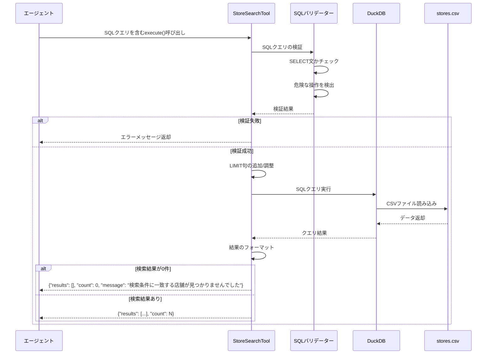
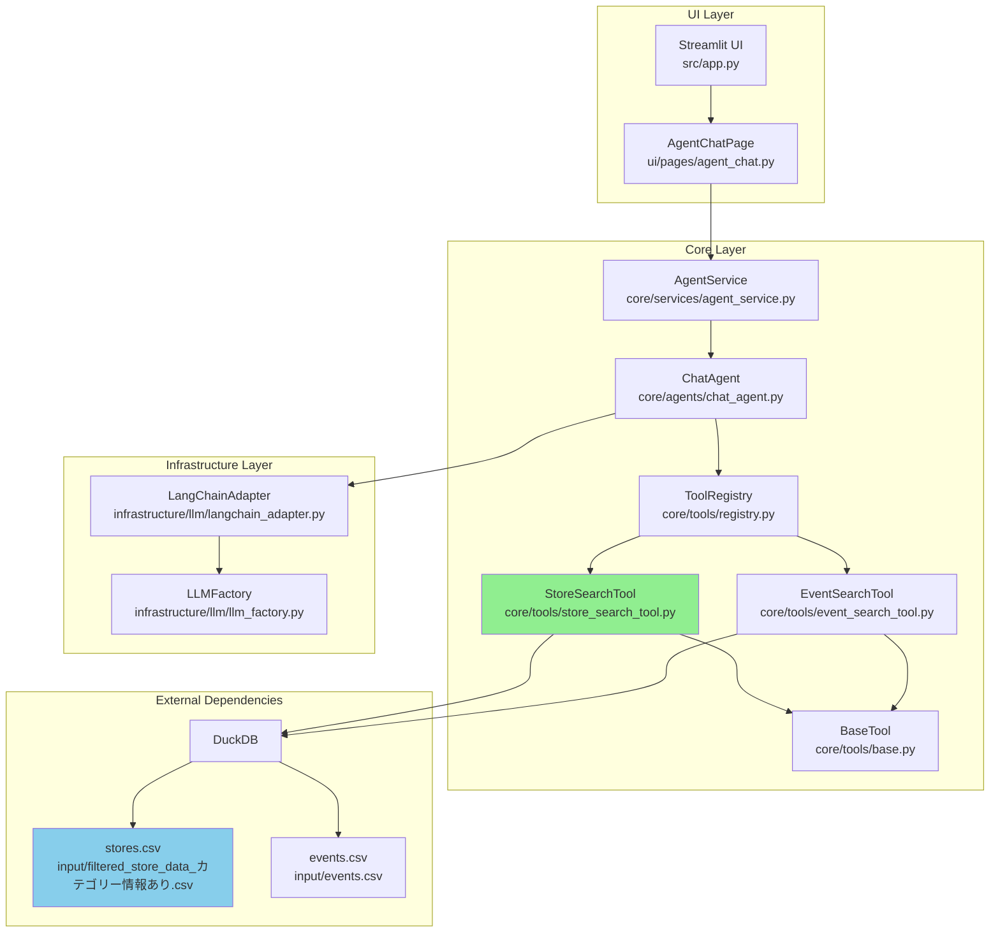
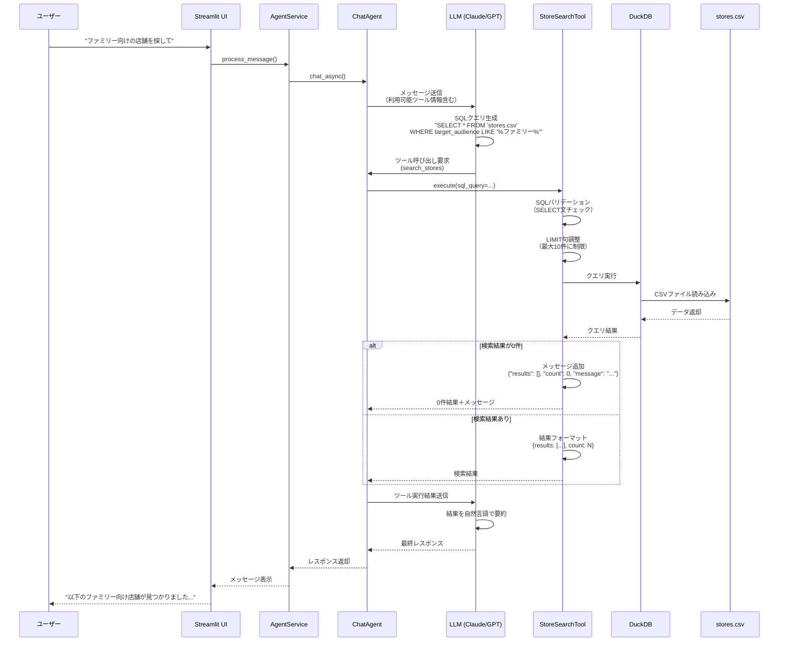

# 店舗データの検索をSQLを使って行うツールの追加

---

## 概要
エージェントが店舗データ(input/filtered_store_data_カテゴリー情報あり.csv)をSQLで検索できるツールを開発する。

### 目的
- エージェントが店舗データを自由度高く検索できるようにしたい

### 背景
- 現状、エージェントは様々なツールを使うことが出来、とあるエリアでのイベントデータは検索できるが店舗データは検索できていない
- コンシェルジュエージェントが汎用的な提案をするためには店舗データの検索が必要
- エージェントは様々な要求に対応できるようにするために、検索ツールの自由度は高くする必要がある

### 要件
- 既存のイベントデータ検索ツールを参考にする
- 共通化できる部分は共通化する
- 既存のツールに習って検索ツールを追加する(完全に新しい機能を追加しようとしない)
- DuckDBを使用してSELECT文による検索を実現する（既存ツールと同様）
- エージェントはSQL文を直接記述してツールに渡す
- セキュリティのため、SELECT文のみ許可し、INSERT/UPDATE/DELETE等は禁止する
- 検索時のデータのlimitは10に設定するようにツールに設定するプロンプトによって指示する
- エージェントは店舗データ: input/filtered_store_data_カテゴリー情報あり.csv（テーブル名: stores.csv）を検索可能
- 各カラムの名前、データ型、説明を記載する
  - データは今後追加などがあるため、データの数などの変化しそうな要素は説明に含めない
- エージェントが理解しやすいように、具体的な検索例を5パターン以上含める
- 検索結果が0件の場合は、その旨をわかりやすく返す
- SQLエラー時は、エラー内容を含めたメッセージを返す
- SELECT以外のSQL文が渡された場合は、エラーとして拒否する

---

## 具体的な設計

### 1. 修正・追加対象ファイル

#### 新規作成するファイル
- `src/core/tools/store_search_tool.py` - 店舗検索ツールの実装

#### 修正するファイル
- `src/core/tools/__init__.py` - 新しいツールの登録
- `src/core/tools/registry.py` - LangChain互換ツールの定義追加

### 2. 使用技術

#### DuckDB
- **選定理由**: CSVファイルに直接SQLクエリを実行できる軽量なデータベースエンジン（既存のEventSearchToolと同じ技術を使用）
- **特徴**:
  - データベースファイルの作成不要
  - CSVファイルを直接読み込んでSQL実行可能
  - Pythonとの統合が容易
  - 高速なクエリ実行
- **インストール**: `pip install duckdb`（既にEventSearchToolで使用中のため追加不要）

### 3. データ仕様

#### 店舗データ(input/filtered_store_data_カテゴリー情報あり.csv)のスキーマ

| カラム名 | データ型 | 説明 | 例 |
|---------|---------|------|-----|
| store_id | TEXT | 店舗ID | "STR-0001" |
| store_name | TEXT | 店舗名 | "麻布台ヒルズマーケット" |
| description | TEXT | 店舗の説明 | "日本の豊かな食文化を伝える33の専門店が集結した食のマーケット..." |
| category | TEXT | カテゴリ | "retail", "restaurant", "cafe" |
| opening_hours | TEXT | 営業時間（JSON形式） | '{"monday": [{"open": "10:00", "close": "20:00"}], ...}' |
| irregular_closures | TEXT | 臨時休業情報（JSON配列形式） | '[{"type": "holiday", "date": "2025-10-04", "reason": "..."}]' |
| phone | TEXT | 電話番号 | "03-5544-9636" |
| email | TEXT | メールアドレス | "info@example.com" または空文字 |
| address | TEXT | 住所 | "麻布台ヒルズ ガーデンプラザC 1F・B1F" |
| Biz_Entertainment_Available | TEXT | ビジネス・エンターテインメント利用可否 | "TRUE" または空文字 |
| private_room | TEXT | 個室情報（JSON形式） | '{"available": true, "capacity": 20, "charge": "有料..."}' |
| pets_allowed | TEXT | ペット同伴可否 | "TRUE" または空文字 |
| target_audience | TEXT | 対象客層（JSON配列形式） | '["ファミリー", "ビジネス", "カップル"]' |
| store_exclusive_events | TEXT | 店舗独自イベント | "体験型ワークショップやクラス、試食会などを開催" |
| menu | TEXT | メニュー情報 | メニューの説明または空文字 |
| seasonal_items | TEXT | 季節商品情報 | 季節商品の説明または空文字 |
| allergy_info | TEXT | アレルギー情報 | アレルギー対応の説明または空文字 |
| gluten_free_info | TEXT | グルテンフリー情報 | グルテンフリー対応の説明または空文字 |
| vegan_info | TEXT | ヴィーガン情報 | ヴィーガン対応の説明または空文字 |
| kids_info | TEXT | 子供向け情報（JSON形式） | '{"kids_menu": null, "highchair": null, "diaper_changing": null}' |
| halal_info | TEXT | ハラール情報 | ハラール対応の説明または空文字 |
| reservations | TEXT | 予約情報 | "予約可" または予約方法の説明 |
| restroom_info | TEXT | トイレ情報 | トイレ情報または空文字 |
| accessibility | TEXT | バリアフリー情報 | アクセシビリティ情報または空文字 |
| parking | TEXT | 駐車場情報（JSON形式） | '{"available": true, "capacity": null, "charge": "駐車料金割引サービスあり"}' |
| nursing_room | TEXT | 授乳室情報 | 授乳室情報または空文字 |
| access_route | TEXT | アクセス方法 | "東京メトロ日比谷線『神谷町駅』5番出口直結..." |
| extraction_status | TEXT | データ抽出ステータス | "success" または "error" |
| error_message | TEXT | エラーメッセージ | エラー時のメッセージまたは空文字 |

**注意点**:
- `opening_hours`, `irregular_closures`, `private_room`, `target_audience`, `kids_info`, `parking`はJSON形式の文字列として格納
- 空値は空文字列で表現（nullは使用されていない）
- JSON形式のカラムは文字列検索（LIKE）で検索可能

### 4. ツールの処理フロー



### 5. 実装内容

#### 5.1 StoreSearchTool クラスの実装

**クラス構造**:
- `BaseTool`を継承
- `name`プロパティ: `"search_stores"`
- `description`プロパティ: ツールの説明とデータスキーマ情報
- `execute(sql_query: str)`メソッド: SQL実行とバリデーション

**主要メソッド**:

##### `execute(sql_query: str) -> dict`
- SQLクエリを受け取り、実行結果を返す
- 処理手順:
  1. SQLクエリのバリデーション（`_validate_sql()`を呼び出し）
  2. LIMIT句の処理（`_ensure_limit()`を呼び出し）
  3. DuckDBでCSVファイルに対してクエリ実行
  4. 結果を辞書形式で返却
     - 結果あり: `{"results": [...], "count": N}`
     - 結果0件: `{"results": [], "count": 0, "message": "検索条件に一致する店舗が見つかりませんでした"}`
  5. エラー時は`{"error": "エラーメッセージ"}`を返却

##### `_validate_sql(sql_query: str) -> tuple[bool, str]`
- SQLクエリが安全かどうかを検証（EventSearchToolと同じロジック）
- 検証項目:
  - SELECT文で始まっているか
  - 危険なキーワードが含まれていないか（INSERT, UPDATE, DELETE, DROP, ALTER, CREATE, TRUNCATE, EXEC, EXECUTE, PRAGMA, ATTACH, DETACHなど）
  - セミコロンで複数クエリが連結されていないか
- 戻り値: (検証成功/失敗, エラーメッセージ)

##### `_ensure_limit(sql_query: str) -> str`
- SQLクエリにLIMIT句を追加または調整（EventSearchToolと同じロジック）
- 処理ロジック:
  - LIMIT句が既に存在する場合: 10以下に制限
  - LIMIT句がない場合: `LIMIT 10`を末尾に追加
- 戻り値: 調整後のSQLクエリ

##### `_execute_duckdb_query(sql_query: str) -> list[dict]`
- DuckDBを使用してCSVファイルに対しSQLを実行（EventSearchToolと同じロジック）
- 処理手順:
  1. DuckDBコネクション作成（インメモリ）
  2. CSVファイルパスを含むSQLクエリ実行
    - テーブル名として`'stores.csv'`または`read_csv('stores.csv')`を使用
  3. 結果を辞書のリストに変換
  4. コネクションクローズ
- 戻り値: クエリ結果（辞書のリスト）

#### 5.2 ツールのdescription（エージェント向けプロンプト）

```
search_stores: 店舗データをSQLクエリで検索します。

【使用方法】
- SQLクエリを指定して店舗情報を検索できます
- FROM句には 'stores.csv' を指定してください
- SELECT文のみ使用可能です（INSERT/UPDATE/DELETE等は使用不可）

【重要な制約】
- 検索結果は最大10件までに制限されます
- クエリにLIMIT句がない場合、自動的に LIMIT 10 が追加されます
- LIMIT句を指定する場合も、10以下に制限されます

【データスキーマ】
テーブル名: stores.csv

カラム:
- store_id (TEXT): 店舗ID（例: "STR-0001"）
- store_name (TEXT): 店舗名
- description (TEXT): 店舗の説明
- category (TEXT): カテゴリ（"retail", "restaurant", "cafe"など）
- opening_hours (TEXT): 営業時間（JSON形式: {"monday": [{"open": "10:00", "close": "20:00"}], ...}）
- irregular_closures (TEXT): 臨時休業情報（JSON配列形式）
- phone (TEXT): 電話番号
- email (TEXT): メールアドレス
- address (TEXT): 住所
- Biz_Entertainment_Available (TEXT): ビジネス・エンターテインメント利用可否（"TRUE"または空文字）
- private_room (TEXT): 個室情報（JSON形式: {"available": true/false, "capacity": 数値, "charge": "説明"}）
- pets_allowed (TEXT): ペット同伴可否（"TRUE"または空文字）
- target_audience (TEXT): 対象客層（JSON配列形式: ["ファミリー", "ビジネス"]）
- store_exclusive_events (TEXT): 店舗独自イベント
- menu (TEXT): メニュー情報
- seasonal_items (TEXT): 季節商品情報
- allergy_info (TEXT): アレルギー情報
- gluten_free_info (TEXT): グルテンフリー情報
- vegan_info (TEXT): ヴィーガン情報
- kids_info (TEXT): 子供向け情報（JSON形式: {"kids_menu": bool, "highchair": bool, "diaper_changing": bool}）
- halal_info (TEXT): ハラール情報
- reservations (TEXT): 予約情報
- restroom_info (TEXT): トイレ情報
- accessibility (TEXT): バリアフリー情報
- parking (TEXT): 駐車場情報（JSON形式: {"available": bool, "capacity": 数値, "charge": "説明"}）
- nursing_room (TEXT): 授乳室情報
- access_route (TEXT): アクセス方法
- extraction_status (TEXT): データ抽出ステータス（"success"または"error"）
- error_message (TEXT): エラーメッセージ

【検索例】
1. 店舗名で検索:
   SELECT * FROM 'stores.csv' WHERE store_name LIKE '%ヒルズ%'

2. カテゴリで検索:
   SELECT * FROM 'stores.csv' WHERE category = 'retail'

3. 駐車場がある店舗を検索:
   SELECT store_name, address, parking FROM 'stores.csv'
   WHERE parking LIKE '%"available": true%'

4. ファミリー向けの店舗を検索:
   SELECT store_name, description, target_audience FROM 'stores.csv'
   WHERE target_audience LIKE '%ファミリー%'

5. 個室が利用可能な店舗を検索:
   SELECT store_name, phone, private_room FROM 'stores.csv'
   WHERE private_room LIKE '%"available": true%'

6. 特定のエリア（住所）で検索:
   SELECT * FROM 'stores.csv' WHERE address LIKE '%麻布台%'

7. ビジネス利用可能な店舗を検索:
   SELECT * FROM 'stores.csv' WHERE Biz_Entertainment_Available = 'TRUE'

8. ペット同伴可能な店舗を検索:
   SELECT * FROM 'stores.csv' WHERE pets_allowed = 'TRUE'
```

#### 5.3 ToolRegistry への登録

`src/core/tools/registry.py`の`_create_langchain_tool()`メソッドに以下を追加:

```python
elif tool_name == "search_stores":
    @tool
    def search_stores(sql_query: str) -> dict:
        """店舗データをSQLクエリで検索します。

        Args:
            sql_query: 実行するSQLクエリ（SELECT文のみ）

        Returns:
            検索結果の辞書（results: 結果リスト, count: 件数）
        """
        return tool_instance.execute(sql_query=sql_query)

    return search_stores
```

### 6. 実装手順とチェック方法

#### ステップ1: StoreSearchToolクラスの基本実装

**実装内容**:
- `src/core/tools/store_search_tool.py`ファイルを新規作成
- EventSearchToolを参考にして`StoreSearchTool`クラスを実装
  - `name`プロパティ: `"search_stores"`
  - `description`プロパティ: 上記のツール説明
  - `execute()`メソッドの基本骨格
  - `_execute_duckdb_query()`メソッド

**チェック方法**:
```bash
# ツールファイルのインポートテスト
PYTHONPATH=. python -c "
from src.core.tools.store_search_tool import StoreSearchTool
tool = StoreSearchTool()
print(f'Tool name: {tool.name}')
print(f'Description length: {len(tool.description)} chars')
"

# 簡単なクエリの実行テスト
PYTHONPATH=. python -c "
from src.core.tools.store_search_tool import StoreSearchTool
tool = StoreSearchTool()
result = tool.execute(sql_query=\"SELECT store_name, category FROM 'stores.csv' LIMIT 3\")
print('Query result:')
import json
print(json.dumps(result, ensure_ascii=False, indent=2))
"
```

**期待される結果**:
- ツール名が表示される（`Tool name: search_stores`）
- descriptionの文字数が表示される
- 3件の店舗名とカテゴリが含まれる検索結果が表示される

---

#### ステップ2: SQLバリデーション機能の実装

**実装内容**:
- `_validate_sql()`メソッドを実装（EventSearchToolと同じロジック）
- 危険なSQLキーワードの検出ロジック
- SELECT文のチェック

**チェック方法**:
```bash
# バリデーションテスト
PYTHONPATH=. python -c "
from src.core.tools.store_search_tool import StoreSearchTool
tool = StoreSearchTool()

# 正常なクエリ
result1 = tool.execute(sql_query=\"SELECT * FROM 'stores.csv' LIMIT 5\")
print('Valid SELECT query:', 'error' not in result1)

# 危険なクエリ（DROP）
result2 = tool.execute(sql_query=\"DROP TABLE stores\")
print('DROP query blocked:', 'error' in result2)

# 危険なクエリ（UPDATE）
result3 = tool.execute(sql_query=\"UPDATE 'stores.csv' SET store_name='test'\")
print('UPDATE query blocked:', 'error' in result3)

# 複数クエリ
result4 = tool.execute(sql_query=\"SELECT * FROM 'stores.csv'; DROP TABLE stores;\")
print('Multiple queries blocked:', 'error' in result4)
"
```

**期待される結果**:
```
Valid SELECT query: True
DROP query blocked: True
UPDATE query blocked: True
Multiple queries blocked: True
```

---

#### ステップ3: LIMIT句の自動調整機能の実装

**実装内容**:
- `_ensure_limit()`メソッドを実装（EventSearchToolと同じロジック）
- LIMIT句がない場合の追加ロジック
- LIMIT値が10を超える場合の調整ロジック

**チェック方法**:
```bash
# LIMIT句の調整テスト
PYTHONPATH=. python -c "
from src.core.tools.store_search_tool import StoreSearchTool
tool = StoreSearchTool()

# LIMIT句なし → LIMIT 10が追加されるか
result1 = tool.execute(sql_query=\"SELECT * FROM 'stores.csv'\")
print('Without LIMIT - Result count:', result1.get('count', 0))
print('Should be <= 10:', result1.get('count', 0) <= 10)

# LIMIT 3 → そのまま
result2 = tool.execute(sql_query=\"SELECT * FROM 'stores.csv' LIMIT 3\")
print('With LIMIT 3 - Result count:', result2.get('count', 0))
print('Should be 3:', result2.get('count', 0) == 3)

# LIMIT 100 → LIMIT 10に調整されるか
result3 = tool.execute(sql_query=\"SELECT * FROM 'stores.csv' LIMIT 100\")
print('With LIMIT 100 - Result count:', result3.get('count', 0))
print('Should be <= 10:', result3.get('count', 0) <= 10)
"
```

**期待される結果**:
```
Without LIMIT - Result count: 10
Should be <= 10: True
With LIMIT 3 - Result count: 3
Should be 3: True
With LIMIT 100 - Result count: 10
Should be <= 10: True
```

---

#### ステップ4: 検索結果0件の処理実装

**実装内容**:
- `execute()`メソッドに検索結果0件時のメッセージ追加処理を実装
- 結果が0件の場合、`{"results": [], "count": 0, "message": "検索条件に一致する店舗が見つかりませんでした"}`を返す

**チェック方法**:
```bash
# 検索結果0件のテスト
PYTHONPATH=. python -c "
from src.core.tools.store_search_tool import StoreSearchTool
tool = StoreSearchTool()

# 存在しない店舗名で検索
result = tool.execute(sql_query=\"SELECT * FROM 'stores.csv' WHERE store_name = '存在しない店舗'\")
print('Result count:', result.get('count', 0))
print('Has message:', 'message' in result)
if 'message' in result:
    print('Message:', result['message'])
"
```

**期待される結果**:
```
Result count: 0
Has message: True
Message: 検索条件に一致する店舗が見つかりませんでした
```

---

#### ステップ5: 様々な検索パターンのテスト

**実装内容**:
- 仕様書に記載した8パターンの検索例を実際に実行してテスト

**チェック方法**:
```bash
# 各種検索パターンのテスト
PYTHONPATH=. python -c "
from src.core.tools.store_search_tool import StoreSearchTool
import json

tool = StoreSearchTool()

# パターン1: 店舗名検索
print('=== パターン1: 店舗名検索 ===')
result1 = tool.execute(sql_query=\"SELECT store_name FROM 'stores.csv' WHERE store_name LIKE '%ヒルズ%'\")
print(f'結果件数: {result1.get(\"count\", 0)}')

# パターン2: カテゴリ検索
print('\n=== パターン2: カテゴリ検索 ===')
result2 = tool.execute(sql_query=\"SELECT store_name, category FROM 'stores.csv' WHERE category = 'retail'\")
print(f'結果件数: {result2.get(\"count\", 0)}')

# パターン3: 駐車場検索
print('\n=== パターン3: 駐車場がある店舗 ===')
result3 = tool.execute(sql_query=\"SELECT store_name FROM 'stores.csv' WHERE parking LIKE '%\\\"available\\\": true%'\")
print(f'結果件数: {result3.get(\"count\", 0)}')

# パターン4: ファミリー向け店舗検索
print('\n=== パターン4: ファミリー向け店舗 ===')
result4 = tool.execute(sql_query=\"SELECT store_name FROM 'stores.csv' WHERE target_audience LIKE '%ファミリー%'\")
print(f'結果件数: {result4.get(\"count\", 0)}')

# パターン5: 個室検索
print('\n=== パターン5: 個室がある店舗 ===')
result5 = tool.execute(sql_query=\"SELECT store_name FROM 'stores.csv' WHERE private_room LIKE '%\\\"available\\\": true%'\")
print(f'結果件数: {result5.get(\"count\", 0)}')

print('\n✓ すべての検索パターンが正常に動作しました')
"
```

**期待される結果**:
- 各検索パターンで適切な件数の結果が返される
- エラーが発生しない

---

#### ステップ6: ToolRegistryへの登録

**実装内容**:
- `src/core/tools/__init__.py`にツールのインポートと登録を追加
- `src/core/tools/registry.py`の`_create_langchain_tool()`メソッドに`search_stores`の分岐を追加

**チェック方法**:
```bash
# ツールレジストリへの登録確認
PYTHONPATH=. python -c "
from src.core.tools import tool_registry

# 登録済みツール一覧
tools = tool_registry.get_all_tool_instances()
print('Registered tools:', list(tools.keys()))
print('search_stores registered:', 'search_stores' in tools)

# ツールインスタンス取得
tool = tool_registry.get_tool_instance('search_stores')
print('Tool instance found:', tool is not None)
print('Tool name:', tool.name if tool else 'N/A')
"

# LangChain互換ツールの確認
PYTHONPATH=. python -c "
from src.core.tools import tool_registry

langchain_tools = tool_registry.get_all_tools()
print('Total LangChain tools:', len(langchain_tools))

# search_storesツールを探す
search_tool = None
for t in langchain_tools:
    if hasattr(t, 'name') and t.name == 'search_stores':
        search_tool = t
        break

print('search_stores LangChain tool found:', search_tool is not None)
if search_tool:
    print('Tool description preview:', search_tool.description[:100] + '...')
"
```

**期待される結果**:
```
Registered tools: ['get_current_time', ..., 'search_events', 'search_stores']
search_stores registered: True
Tool instance found: True
Tool name: search_stores

Total LangChain tools: 8
search_stores LangChain tool found: True
Tool description preview: 店舗データをSQLクエリで検索します。

【使用方法】
- SQLクエリを指定して店舗情報を検索できます...
```

---

#### ステップ7: エージェント統合テスト

**実装内容**:
- AgentServiceでの利用確認
- Streamlit UIでの動作確認

**チェック方法**:
```bash
# AgentServiceでツールが利用可能か確認
PYTHONPATH=. python -c "
from src.core.services.agent_service import AgentService
from src.core.agents.chat_agent import ChatAgent
from src.infrastructure.llm.llm_factory import LLMFactory
from src.core.tools import tool_registry

# エージェント作成
llm_adapter = LLMFactory.create_llm('claude-sonnet-4.5')
agent = ChatAgent(llm_adapter=llm_adapter, tools=tool_registry.get_all_tools())

# ツール一覧に search_stores が含まれているか
available_tools = agent.get_available_tools()
print('Available tools:', available_tools)
print('search_stores available:', 'search_stores' in available_tools)
"

# Streamlitアプリケーション起動テスト（手動確認）
echo "次のコマンドでStreamlitアプリを起動し、エージェントに以下の質問をしてください:"
echo "make run"
echo ""
echo "【テスト質問例】"
echo "1. 「ファミリー向けの店舗を探して」"
echo "2. 「駐車場がある店舗を教えて」"
echo "3. 「個室がある店舗は?」"
echo "4. 「麻布台エリアの店舗を検索して」"
```

**期待される結果**:
- `search_stores`がツール一覧に含まれる
- Streamlit UIでエージェントが`search_stores`ツールを使用して店舗検索を実行できる

**手動テストシナリオ**:
1. Streamlitアプリを起動
2. 以下の質問をエージェントに投げる:
   - "ファミリー向けの店舗を探して"
   - "駐車場がある店舗を教えて"
   - "個室が利用できる店舗は?"
   - "麻布台エリアの店舗を検索して"
   - "ビジネス利用可能な店舗は?"
3. エージェントが`search_stores`ツールを呼び出し、適切なSQLクエリを生成して検索結果を返すことを確認

---

#### ステップ8: ユニットテストの作成と実行

**実装内容**:
- `tests/unit/core/tools/test_store_search_tool.py`を作成
- EventSearchToolのテストを参考に、以下のテストケースを実装:
  - SQLバリデーション（正常系/異常系）
  - LIMIT句の調整
  - DuckDBクエリ実行
  - 検索結果0件のケース
  - エラーハンドリング

**チェック方法**:
```bash
# ユニットテスト実行
PYTHONPATH=. pytest tests/unit/core/tools/test_store_search_tool.py -v

# カバレッジ付きテスト実行
PYTHONPATH=. pytest tests/unit/core/tools/test_store_search_tool.py -v --cov=src/core/tools/store_search_tool --cov-report=term-missing
```

**期待される結果**:
- すべてのテストがPASSする
- コードカバレッジが80%以上

---

### 7. アーキテクチャ図



**図の説明**:
- **緑色（StoreSearchTool）**: 今回新規実装するツール
- **青色（stores.csv）**: 検索対象データ
- DuckDBは既存のEventSearchToolでも使用されているため、追加のインストール不要

---

### 8. データフロー図



---

### 9. 最終的に満たすべき要件

#### 機能要件
- ✅ エージェントがSQLクエリを生成して店舗データを検索できる
- ✅ 全29カラムが検索対象（store_id, store_name, description, category, opening_hours, irregular_closures, phone, email, address, Biz_Entertainment_Available, private_room, pets_allowed, target_audience, store_exclusive_events, menu, seasonal_items, allergy_info, gluten_free_info, vegan_info, kids_info, halal_info, reservations, restroom_info, accessibility, parking, nursing_room, access_route, extraction_status, error_message）
- ✅ 検索結果は最大10件に制限される
- ✅ SELECT文のみ実行可能（INSERT/UPDATE/DELETE等は禁止）
- ✅ ツールのdescriptionにデータスキーマ情報と8つの検索例が含まれる
- ✅ 検索結果0件の場合、わかりやすいメッセージを返す

#### 技術要件
- ✅ DuckDBを使用してCSVファイルに直接SQLクエリを実行（既存ツールと同じ技術）
- ✅ データベースファイルの作成不要（インメモリ実行）
- ✅ 既存のツールアーキテクチャ（BaseToolパターン、ToolRegistry）に準拠
- ✅ EventSearchToolと同じ実装パターンを使用（コード再利用性）
- ✅ Clean Architectureの層分離を維持

#### セキュリティ要件
- ✅ SQLインジェクション対策（危険なキーワードの検出）
- ✅ 複数クエリ実行の防止（セミコロン区切りの検出）
- ✅ SELECT文以外の実行を拒否

#### テスト要件
- ✅ ユニットテストが実装されている
- ✅ 正常系・異常系のテストケースをカバー
  - SQLバリデーション（正常/異常）
  - LIMIT句の調整
  - DuckDBクエリ実行
  - 検索結果0件のケース
  - エラーハンドリング
- ✅ コードカバレッジ80%以上

#### 運用要件
- ✅ エラー発生時に適切なエラーメッセージを返却
- ✅ SQLエラー時にエラー内容を含めたメッセージを返す
- ✅ ログ出力による動作トレース可能性
- ✅ DuckDBは既存ツールで使用中のため、追加の依存関係設定不要

---

## 補足事項

### JSON形式カラムの検索方法

一部のカラム（opening_hours, irregular_closures, private_room, target_audience, kids_info, parking）はJSON形式の文字列として保存されています。これらを検索する際の例:

```sql
-- 駐車場がある店舗の検索
SELECT * FROM 'stores.csv' WHERE parking LIKE '%"available": true%'

-- ファミリー向け店舗の検索
SELECT * FROM 'stores.csv' WHERE target_audience LIKE '%ファミリー%'

-- 個室が利用可能な店舗（20名以上収容）
SELECT * FROM 'stores.csv' WHERE private_room LIKE '%"available": true%' AND private_room LIKE '%"capacity": 2%'

-- ペット同伴可能な店舗
SELECT * FROM 'stores.csv' WHERE pets_allowed = 'TRUE'

-- ビジネス利用可能な店舗
SELECT * FROM 'stores.csv' WHERE Biz_Entertainment_Available = 'TRUE'
```

### エージェントへの指示例

エージェントに対してユーザーが自然言語で質問した場合、エージェントは以下のようにSQLクエリに変換することが期待されます:

| ユーザーの質問 | エージェントが生成するSQLクエリ例 |
|-------------|---------------------------|
| "ファミリー向けの店舗を探して" | `SELECT * FROM 'stores.csv' WHERE target_audience LIKE '%ファミリー%' LIMIT 10` |
| "駐車場がある店舗は?" | `SELECT store_name, address, parking FROM 'stores.csv' WHERE parking LIKE '%"available": true%' LIMIT 10` |
| "個室が使える店舗を教えて" | `SELECT store_name, phone, private_room FROM 'stores.csv' WHERE private_room LIKE '%"available": true%' LIMIT 10` |
| "麻布台エリアの店舗を検索" | `SELECT * FROM 'stores.csv' WHERE address LIKE '%麻布台%' LIMIT 10` |
| "ビジネスで使える店舗は?" | `SELECT * FROM 'stores.csv' WHERE Biz_Entertainment_Available = 'TRUE' LIMIT 10` |
| "ペット同伴可能な店舗" | `SELECT * FROM 'stores.csv' WHERE pets_allowed = 'TRUE' LIMIT 10` |
| "カフェを探して" | `SELECT * FROM 'stores.csv' WHERE category = 'cafe' LIMIT 10` |
| "イベントを開催している店舗" | `SELECT store_name, store_exclusive_events FROM 'stores.csv' WHERE store_exclusive_events != '' LIMIT 10` |

### パフォーマンス考慮事項

- DuckDBはCSVファイルを効率的に読み込むため、数千行程度のデータであれば高速に検索可能
- 現状のデータ規模（10店舗）では、インデックス等のパフォーマンスチューニングは不要
- データ量が増加した場合（数万行以上）、以下を検討:
  - DuckDBのパーシステント（永続）データベース化
  - インデックスの作成
  - 頻繁に検索されるカラムの最適化

### EventSearchToolとの共通化について

StoreSearchToolとEventSearchToolは非常に類似した構造を持っています。以下のメソッドは同じロジックを使用します:
- `_validate_sql()`: SQLバリデーション
- `_ensure_limit()`: LIMIT句の調整
- `_execute_duckdb_query()`: DuckDBクエリ実行

**今後の改善案**:
- 共通ロジックを`BaseTool`または新しい`SQLSearchToolBase`クラスに抽出
- コード重複を削減し、メンテナンス性を向上
- ただし、現時点では既存のEventSearchToolと同じパターンで実装することを優先（要件: "既存のツールに習って検索ツールを追加する"）
