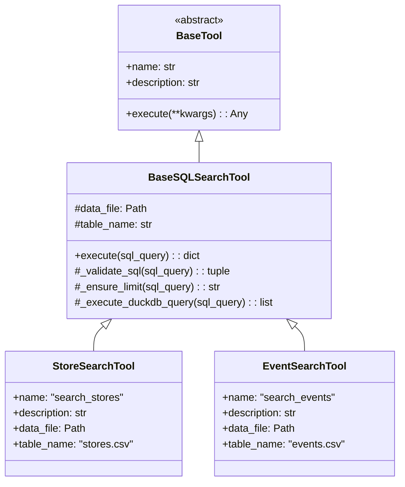
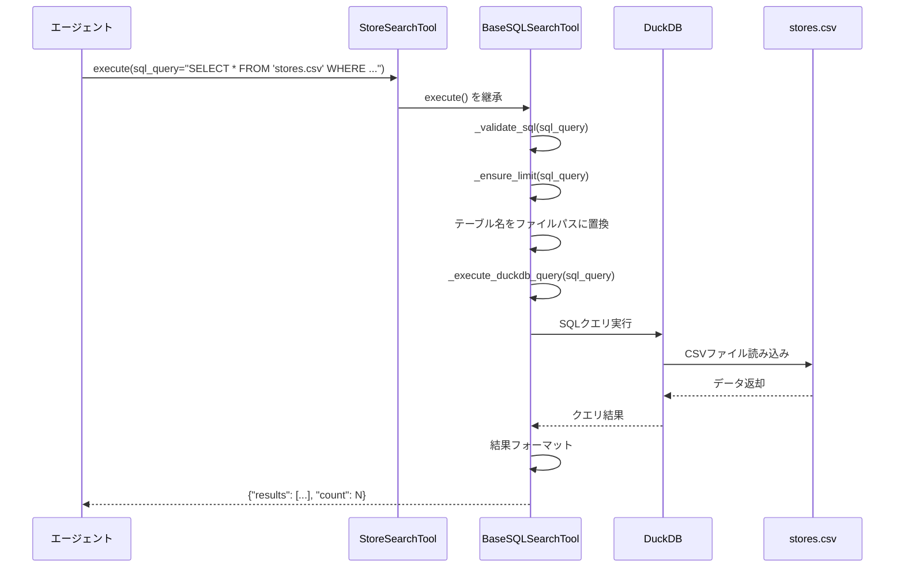

# 店舗検索ツールの統合とSQL検索ツールの共通化

---

## 概要
店舗関連ツールを統合し、EventSearchToolとStoreSearchToolで重複している共通ロジックを基底クラスに抽出してコードの保守性を向上させる。

### 目的
- 店舗検索を1つのツール（`search_stores`）に統合し、イベント検索と同じシンプルな構成にする
- EventSearchToolとStoreSearchToolで重複しているSQLバリデーション、LIMIT調整、DuckDB実行ロジックを共通化する
- 冗長なツール（`check_store_hours`、`get_store_info`、`get_event_info`）を削除してエージェントのツール選択を簡潔にする

### 背景
- 現在、店舗関連ツールが3つ（`search_stores`, `check_store_hours`, `get_store_info`）存在し、責務が分散している
- EventSearchToolとStoreSearchToolは同じロジック（`_validate_sql`, `_ensure_limit`, `_execute_duckdb_query`）を重複実装している（約150行）
- イベント検索は`search_events` 1つで開催期間も含めて検索できるのに対し、店舗検索は複数ツールに分かれている
- コードの重複によりメンテナンスコストが高く、バグ修正や機能追加が非効率

### 要件
- イベント検索と同じ構成にする：1つのSQL検索ツールで全ての情報（営業時間含む）を取得可能にする
- 共通ロジックを基底クラス（`BaseSQLSearchTool`）に抽出する
- 既存のテストが全て通ることを各ステップで確認する（段階的リファクタリング）
- 既存の機能を壊さない
- エージェントのシステムプロンプトを更新する必要がある場合は明記する

---

## 具体的な設計

### 1. 修正・追加対象ファイル

#### 新規作成するファイル
- `src/core/tools/base_sql_search_tool.py` - SQL検索ツールの共通基底クラス
- `tests/unit/core/tools/test_base_sql_search_tool.py` - 基底クラスのテスト（推奨）

#### 修正するファイル
- `src/core/tools/event_search_tool.py` - BaseSQLSearchToolを継承するようリファクタリング
- `src/core/tools/store_search_tool.py` - BaseSQLSearchToolを継承するようリファクタリング
- `src/core/tools/data_search_tool.py` - check_store_hours、get_store_info、get_event_infoを削除（またはファイルごと削除）
- `src/core/tools/__init__.py` - ツール登録の更新
- `src/core/tools/registry.py` - 削除されたツールのLangChain登録を除去
- `src/config/prompts.py` - システムプロンプトの更新（必要に応じて）

#### 削除されるツール
- `StoreHoursCheckTool` (check_store_hours) - search_storesで営業時間も検索可能なため不要
- `StoreInfoTool` (get_store_info) - search_storesで店舗詳細も検索可能なため不要
- `EventInfoTool` (get_event_info) - search_eventsでイベント詳細も検索可能なため不要

### 2. アーキテクチャ変更

#### 変更前の構成
```
店舗関連ツール（3個）:
├─ search_stores (StoreSearchTool) - SQL検索
├─ check_store_hours (StoreHoursCheckTool) - 営業時間チェック
└─ get_store_info (StoreInfoTool) - 店舗詳細取得

イベント関連ツール（2個）:
├─ search_events (EventSearchTool) - SQL検索
└─ get_event_info (EventInfoTool) - イベント詳細取得

問題点:
- StoreSearchToolとEventSearchToolでコード重複（約150行）
- 店舗は3ツール、イベントは2ツールと構成が非統一
- 営業時間データはCSVに含まれているのに専用ツールが存在
```

#### 変更後の構成
```
共通基底クラス:
└─ BaseSQLSearchTool
   ├─ _validate_sql() - SQLバリデーション
   ├─ _ensure_limit() - LIMIT句調整
   └─ _execute_duckdb_query() - DuckDB実行

店舗関連ツール（1個）:
└─ search_stores (StoreSearchTool) - SQL検索（営業時間、詳細情報全て含む）

イベント関連ツール（1個）:
└─ search_events (EventSearchTool) - SQL検索（開催期間、詳細情報全て含む）

改善点:
- コード重複が約150行削減
- 店舗もイベントも1ツールに統一（構成の一貫性）
- 営業時間や詳細情報はCSVデータのカラムとして検索可能
```

### 3. 共通化するロジック

#### BaseSQLSearchTool クラスの実装

**クラス構造**:
- `BaseTool`を継承
- EventSearchToolとStoreSearchToolの共通ロジックを提供
- サブクラスで`data_file`と`table_name`を設定

**共通化されるメソッド**:

##### `execute(sql_query: str) -> dict`
- SQLクエリを受け取り、実行結果を返す
- 処理手順:
  1. SQLクエリのバリデーション（`_validate_sql()`を呼び出し）
  2. LIMIT句の処理（`_ensure_limit()`を呼び出し）
  3. テーブル名をファイルパスに置換
  4. DuckDBでCSVファイルに対してクエリ実行
  5. 結果を辞書形式で返却
     - 結果あり: `{"results": [...], "count": N}`
     - 結果0件（店舗のみ）: `{"results": [], "count": 0, "message": "検索条件に一致する店舗が見つかりませんでした"}`
  6. エラー時は`{"error": "エラーメッセージ"}`を返却

##### `_validate_sql(sql_query: str) -> tuple[bool, str]`
- SQLクエリが安全かどうかを検証
- 検証項目:
  - SELECT文で始まっているか
  - 危険なキーワードが含まれていないか（INSERT, UPDATE, DELETE, DROP, ALTER, CREATE, TRUNCATE, EXEC, EXECUTE, PRAGMA, ATTACH, DETACHなど）
  - セミコロンで複数クエリが連結されていないか
- 戻り値: (検証成功/失敗, エラーメッセージ)

##### `_ensure_limit(sql_query: str) -> str`
- SQLクエリにLIMIT句を追加または調整
- 処理ロジック:
  - LIMIT句が既に存在する場合: 10以下に制限
  - LIMIT句がない場合: `LIMIT 10`を末尾に追加
- 戻り値: 調整後のSQLクエリ

##### `_execute_duckdb_query(sql_query: str) -> list[dict]`
- DuckDBを使用してCSVファイルに対しSQLを実行
- 処理手順:
  1. DuckDBコネクション作成（インメモリ）
  2. CSVファイルパスを含むSQLクエリ実行
  3. 結果を辞書のリストに変換
  4. コネクションクローズ
- 戻り値: クエリ結果（辞書のリスト）

### 4. 処理フロー図

#### リファクタリング後のクラス継承構造



#### 検索処理フロー



### 5. 実装手順とチェック方法

#### Phase 1: BaseSQLSearchTool の作成

**実装内容**:
- `src/core/tools/base_sql_search_tool.py`ファイルを新規作成
- EventSearchToolとStoreSearchToolから共通ロジックを抽出
  - `execute()`メソッド
  - `_validate_sql()`メソッド
  - `_ensure_limit()`メソッド
  - `_execute_duckdb_query()`メソッド

**チェック方法**:
```bash
# ファイルのインポートテスト
PYTHONPATH=. python -c "
from src.core.tools.base_sql_search_tool import BaseSQLSearchTool
print('BaseSQLSearchTool imported successfully')
print('Methods:', [m for m in dir(BaseSQLSearchTool) if not m.startswith('_')])
"

# 型チェック
PYTHONPATH=. mypy src/core/tools/base_sql_search_tool.py --no-error-summary
```

**期待される結果**:
- インポートが成功する
- 型チェックがパスする
- メソッド一覧に `execute` が含まれる

---

#### Phase 2: StoreSearchTool のリファクタリング

**実装内容**:
- `src/core/tools/store_search_tool.py`を修正
- `BaseSQLSearchTool`を継承
- 共通メソッド（`_validate_sql`, `_ensure_limit`, `_execute_duckdb_query`）を削除
- `data_file`と`table_name`プロパティを設定

**チェック方法**:
```bash
# 既存のテストを実行
PYTHONPATH=. pytest tests/unit/core/tools/test_store_search_tool.py -v

# 動作確認
PYTHONPATH=. python -c "
from src.core.tools.store_search_tool import StoreSearchTool
tool = StoreSearchTool()
print(f'Tool name: {tool.name}')

# 簡単なクエリ実行
result = tool.execute(sql_query=\"SELECT store_name FROM 'stores.csv' LIMIT 3\")
print(f'Result count: {result.get(\"count\", 0)}')
if result.get('results'):
    print('First store:', result['results'][0].get('store_name', 'N/A'))
"
```

**期待される結果**:
- 既存のテストが全てパスする
- ツール名が正しく表示される（`search_stores`）
- SQLクエリが正常に実行される

---

#### Phase 3: EventSearchTool のリファクタリング

**実装内容**:
- `src/core/tools/event_search_tool.py`を修正
- `BaseSQLSearchTool`を継承
- 共通メソッドを削除
- `data_file`と`table_name`プロパティを設定

**チェック方法**:
```bash
# 既存のテストを実行
PYTHONPATH=. pytest tests/unit/core/tools/test_event_search_tool.py -v

# 動作確認
PYTHONPATH=. python -c "
from src.core.tools.event_search_tool import EventSearchTool
tool = EventSearchTool()
print(f'Tool name: {tool.name}')

# 簡単なクエリ実行
result = tool.execute(sql_query=\"SELECT event_name FROM 'events.csv' LIMIT 3\")
print(f'Result count: {result.get(\"count\", 0)}')
"
```

**期待される結果**:
- 既存のテストが全てパスする
- ツール名が正しく表示される（`search_events`）

---

#### Phase 4: 不要なツールの削除

**実装内容**:
- `src/core/tools/data_search_tool.py`から以下を削除:
  - `StoreHoursCheckTool`クラス
  - `StoreInfoTool`クラス
  - `EventInfoTool`クラス
  - ヘルパー関数`find_data_file`（他で使用されていない場合）
- すべてのクラスを削除した場合、ファイルごと削除を推奨
- `src/core/tools/__init__.py`からツール登録を削除
- `src/core/tools/registry.py`から対応するLangChain登録を削除

**チェック方法**:
```bash
# ツールレジストリの確認
PYTHONPATH=. python -c "
from src.core.tools import tool_registry

# 登録済みツール一覧
tools = tool_registry.get_all_tool_instances()
print('Registered tools:', list(tools.keys()))

# 削除されたツールが含まれていないことを確認
deleted_tools = ['check_store_hours', 'get_store_info', 'get_event_info']
for tool_name in deleted_tools:
    if tool_name in tools:
        print(f'ERROR: {tool_name} should be deleted but still registered')
    else:
        print(f'OK: {tool_name} successfully removed')
"
```

**期待される結果**:
```
Registered tools: ['get_current_time', 'search_events', 'search_stores', 'get_weather', 'search_products']
OK: check_store_hours successfully removed
OK: get_store_info successfully removed
OK: get_event_info successfully removed
```

---

#### Phase 5: 全体テストとコードカバレッジ確認

**実装内容**:
- すべてのユニットテストを実行
- コードカバレッジを確認

**チェック方法**:
```bash
# 全ツールのテスト実行
PYTHONPATH=. pytest tests/unit/core/tools/ -v

# カバレッジ付きテスト
PYTHONPATH=. pytest tests/unit/core/tools/ -v --cov=src/core/tools --cov-report=term-missing

# 型チェック
PYTHONPATH=. mypy src/core/tools/ --no-error-summary

# コード品質チェック
make check-all
```

**期待される結果**:
- すべてのテストがパスする
- コードカバレッジが80%以上
- 型チェックがパスする
- リントエラーがない

---

#### Phase 6: 統合テスト（エージェントでの動作確認）

**実装内容**:
- Streamlit UIでエージェントが正しくツールを使用できることを確認

**チェック方法**:
```bash
# Streamlitアプリ起動
make run
```

**手動テストシナリオ**:

1. **店舗検索テスト**:
   - 質問: "ファミリー向けの店舗を探して"
   - 期待: `search_stores`を使用してSQL検索を実行

2. **営業時間検索テスト（旧check_store_hoursの代替）**:
   - 質問: "麻布台ヒルズマーケットの営業時間は？"
   - 期待: `search_stores`を使用して`opening_hours`カラムを取得

3. **店舗詳細取得テスト（旧get_store_infoの代替）**:
   - 質問: "バルコニーバイシックスの詳細情報を教えて"
   - 期待: `search_stores`を使用して全カラムを取得

4. **複合検索テスト**:
   - 質問: "駐車場があってファミリー向けの店舗は？"
   - 期待: `search_stores`を使用してWHERE句で複数条件を指定

**期待される結果**:
- エージェントが適切なツールを選択する
- SQL検索で正しい結果が返される
- 削除されたツール（check_store_hours等）を呼び出そうとしない

---

### 6. ツール削除に伴う変更

#### 削除理由
これらのツールが提供する機能は、SQLクエリで実現可能:
- CSVデータには営業時間（opening_hours）、店舗詳細、イベント詳細が全て含まれている
- エージェントがツールを選択する際の選択肢を減らし、判断をシンプルにする
- イベント検索と構成を統一する

#### 削除後の代替方法
```sql
-- 旧: check_store_hours(store_name="マーケット")
-- 新: search_stores(sql_query="SELECT store_name, opening_hours FROM 'stores.csv' WHERE store_name LIKE '%マーケット%'")

-- 旧: get_store_info(store_name="マーケット")
-- 新: search_stores(sql_query="SELECT * FROM 'stores.csv' WHERE store_name LIKE '%マーケット%'")

-- 旧: get_event_info(event_name="BMW")
-- 新: search_events(sql_query="SELECT * FROM 'events.csv' WHERE event_name LIKE '%BMW%'")
```

### 7. システムプロンプトの更新（必須）

#### 重要：時間判定の動作変更について

**現状の動作**:
- **イベント**: `search_events`でdate_timeを取得 → **LLMが開催中かどうか判定**（既存）
- **店舗**: `check_store_hours`を使用 → **ツールが営業中かどうか判定**（専用ツール）

**リファクタリング後の動作**:
- **イベント**: `search_events`でdate_timeを取得 → **LLMが開催中かどうか判定**（変化なし）
- **店舗**: `search_stores`でopening_hoursを取得 → **LLMが営業中かどうか判定**（統一）

**判定実績**:
- LLMは既にイベントの開催期間判定で実績がある
- システムプロンプトに現在時刻が表示されている（`[現在時刻: {current_time_jst}]`）
- LLMは現在時刻を参照して正確に判定可能

#### 更新が必要な箇所

##### 箇所1: [src/config/prompts.py:120](src/config/prompts.py#L120)

**現在**:
```python
6. **営業時間チェック**: 店舗に関する質問には、必ず営業時間チェックツールを使用して現在の営業状況を確認してください
```

**更新後**:
```python
6. **営業時間確認**: 店舗の営業状況を確認する際は、search_storesツールでopening_hoursカラムを取得し、
   現在時刻（システムに表示されている[現在時刻]を参照）と比較して営業中かどうかを判定してください。
   opening_hoursはJSON形式（例: {"monday": [{"open": "10:00", "close": "20:00"}]}）で格納されています。
   イベントの開催状況確認も同様に、search_eventsでdate_timeカラムを取得して判定してください。
```

##### 箇所2: [src/config/prompts.py:230](src/config/prompts.py#L230)

**現在**:
```python
- **営業状況確認**: 店舗名が挙げられた時は営業時間チェックツールで現在の営業状況を確認
```

**更新後**:
```python
- **営業状況確認**: 店舗名が挙げられた時は、search_storesツールでopening_hoursカラムを取得し、
  現在時刻と比較して営業中/営業時間外を判定してください
```

##### 箇所3: [src/config/prompts.py:186](src/config/prompts.py#L186)（主要機能の記述）

**現在**:
```python
主要機能:
- **営業状況確認**: 店舗名を指定して現在営業中かどうかを即座に判定
```

**更新後**:
```python
主要機能:
- **営業状況確認**: 店舗の営業時間データを取得し、現在時刻と照合して営業中かどうかを判定
```

#### 更新理由

1. **構成の統一**: イベントと店舗で時間判定方法を統一
2. **ツール削除**: `check_store_hours`ツールが削除されるため、プロンプトの更新が必須
3. **既存実績**: LLMは既にイベントで時間判定を行っており、店舗でも同様に可能

---

### 8. 最終的に満たすべき要件

#### 機能要件
- ✅ 店舗検索は`search_stores` 1つのツールで実現できる
- ✅ イベント検索は`search_events` 1つのツールで実現できる
- ✅ 営業時間情報は`opening_hours`カラムで取得可能
- ✅ 店舗詳細情報はSQLで全カラム取得可能
- ✅ イベント詳細情報はSQLで全カラム取得可能
- ✅ 既存の検索機能が全て維持されている

#### コード品質要件
- ✅ EventSearchToolとStoreSearchToolの共通ロジックが基底クラスに抽出されている
- ✅ コード重複が約150行削減されている
- ✅ BaseSQLSearchToolを継承することで、新しいSQL検索ツールの追加が容易
- ✅ 既存のテストが全てパスする
- ✅ 型チェックがパスする
- ✅ コードカバレッジが80%以上

#### アーキテクチャ要件
- ✅ Clean Architectureの層分離が維持されている
- ✅ 既存のツールアーキテクチャ（BaseToolパターン、ToolRegistry）に準拠
- ✅ 継承構造が明確（BaseTool → BaseSQLSearchTool → 各検索ツール）
- ✅ イベント検索と店舗検索の構成が統一されている

#### セキュリティ要件
- ✅ SQLインジェクション対策が維持されている（基底クラスで一元管理）
- ✅ 複数クエリ実行の防止が維持されている
- ✅ SELECT文以外の実行が拒否される

---

## 補足事項

### コード削減量の試算

**変更前**:
- `EventSearchTool`: 約250行
- `StoreSearchTool`: 約270行
- `check_store_hours`: 約160行
- `get_store_info`: 約60行
- `get_event_info`: 約60行
- **合計: 約800行**

**変更後**:
- `BaseSQLSearchTool`: 約180行（共通ロジック）
- `EventSearchTool`: 約100行（固有実装のみ）
- `StoreSearchTool`: 約120行（固有実装のみ）
- **合計: 約400行**

**削減量: 約400行（50%削減）**

### 今後の拡張性

新しいSQL検索ツールを追加する場合（例：レビュー検索など）、`BaseSQLSearchTool`を継承するだけで実装できます（必要な実装は約50行のみ）。

### data_search_tool.py の最終状態

すべてのツールクラスを削除した場合、`find_data_file`関数が他で使用されていないため、**ファイルごと削除することを推奨**します。

---

## まとめ

このリファクタリングにより以下を実現します:

1. **コードの保守性向上**: 共通ロジックを基底クラスに集約し、重複を50%削減
2. **構成の統一**: イベント検索と店舗検索を同じ1ツール構成に統一
3. **エージェントの使いやすさ向上**: ツール数を削減（5個→2個）し、選択を簡素化
4. **拡張性の向上**: 新しいSQL検索ツールの追加が容易
5. **既存機能の維持**: すべての機能がSQL検索で実現可能

段階的なリファクタリングにより、既存の動作を壊さずに安全に実装を進めることができます。
